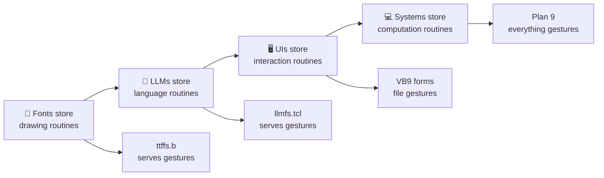

# The Grand Unification: Fonts → LLMs → UI → Computing

This document reveals the deep connections between our discoveries about fonts, LLMs, user interfaces, and the fundamental nature of computing.

## 🌊 The Universal Pattern: Everything is Gesture Casting

### The Progression of Understanding



### The Mathematical Foundation

All computational systems are **gesture foundries** operating on the same mathematical principles:

```scheme
(define universal-foundry
  (lambda (input context parameters)
    ;; 1. Map input to gesture space
    (let ((gesture-space (map-to-space input context)))
      ;; 2. Select appropriate routine  
      (let ((routine (select-routine gesture-space parameters)))
        ;; 3. Cast the gesture with controlled variation
        (cast-routine routine gesture-space parameters)))))
```

This pattern applies to:
- **Fonts**: `cast-routine = render-glyph`
- **LLMs**: `cast-routine = generate-language`  
- **UIs**: `cast-routine = handle-interaction`
- **Systems**: `cast-routine = execute-computation`

## 🎭 The Three Fundamental Gestures Revisited

From our [Architectural Insights](ARCHITECTURAL-INSIGHTS.md), all computing reduces to three operations. Now we see these are actually **gesture types**:

### 1. DISPLACE Gestures (∂/∂x)
- **Fonts**: Move pen to next glyph position
- **LLMs**: Move attention through semantic space  
- **UIs**: Move focus between interface elements
- **Systems**: Move data between namespaces

### 2. REPLACE Gestures (δ/δx)
- **Fonts**: Replace outline with rendered pixels
- **LLMs**: Replace context with generated tokens
- **UIs**: Replace interface state with user action
- **Systems**: Replace process state with computation result

### 3. INTERFACE Gestures (∇×)
- **Fonts**: Interface between design space and pixel space
- **LLMs**: Interface between meaning space and token space
- **UIs**: Interface between user intent and system action
- **Systems**: Interface between problem space and solution space

## 🔄 Gauge Symmetries Across All Domains

The **gauge symmetry** insight from our LLM work applies universally:

### Font Gauge Symmetries
```c
// Many ways to render the same character
char 'A' can be rendered as:
- Serif A, Sans-serif A, Script A, Display A
// Different pixels, SAME GESTURE (representing 'A')
// Font hinting preserves the essential character
```

### LLM Gauge Symmetries  
```scheme
;; Many ways to express the same meaning
(meaning "greeting") can be expressed as:
- "Hello", "Hi", "Hey", "Greetings"
;; Different tokens, SAME GESTURE (friendly greeting)
;; Temperature controls which variations are allowed
```

### UI Gauge Symmetries
```bash
# Many ways to trigger the same action
button_click_gesture can be performed as:
- Mouse click, Enter key, Touch tap, Voice command
# Different inputs, SAME GESTURE (user selection)
# VB9 preserves the action meaning across input methods
```

### System Gauge Symmetries
```bash
# Many ways to achieve the same computation
file_read_gesture can be performed as:
- Local disk, Network mount, Memory map, Database query
# Different implementations, SAME GESTURE (data access)
# Plan 9 preserves the operation meaning across resources
```

## 🌡️ Temperature/Resolution Control is Universal

The **temperature as resolution** insight generalizes:

### Font Resolution Control
```c
// Font size controls rendering resolution
render_glyph(character='A', size=72);  // High resolution, sharp details
render_glyph(character='A', size=8);   // Low resolution, essential form
```

### LLM Resolution Control
```python
# Temperature controls generation resolution  
generate_text(prompt="Hello", temperature=0.0)  # High resolution, precise
generate_text(prompt="Hello", temperature=1.5)  # Low resolution, creative
```

### UI Resolution Control
```c
// Interaction precision controls interface resolution
handle_input(precision=HIGH);   // Exact pixel positioning required
handle_input(precision=LOW);    // Rough gesture recognition sufficient
```

### System Resolution Control
```bash
# Computation precision controls system resolution
/proc/precision/high    # Exact results required
/proc/precision/low     # Approximate results acceptable
```

## 🎨 The Drawing = Computing Connection

Our breakthrough insight: **Drawing and Computing are the same operation**

### Font Drawing = Glyph Computing
```c
// Drawing a character IS computing its visual representation
draw_character('A', position, style) == compute_glyph_bitmap('A', transform)
```

### LLM Generation = Language Computing
```python
# Generating text IS computing linguistic representation
generate_response(prompt, context) == compute_language_gesture(meaning, style)
```

### UI Rendering = Interaction Computing
```c
// Rendering interface IS computing interaction possibilities  
render_form(controls, layout) == compute_interaction_space(actions, context)
```

### VB9 Form Display = Distributed Computing
```bash
# Displaying form IS computing across network namespace
cat /form/button1/state == compute_distributed_interface(/net/server/form/)
```

## 🧬 The DNA of Computational Systems

Every computational system has the same basic structure:

```
Computational System DNA:
├── Gesture Repertoire     (what routines can be performed)
├── Casting Engine         (how routines are executed)  
├── Resolution Control     (precision/creativity balance)
├── Gauge Symmetries       (equivalent performance variations)
├── Context Sensitivity    (how environment affects performance)
└── Performance Cache      (storing results of routine executions)
```

### Examples Across Domains

#### Font System DNA
```
ttffs DNA:
├── Glyph Outlines        (drawing routines)
├── Rasterizer           (casting engine)
├── Size/DPI Control     (resolution control)
├── Style Variations     (gauge symmetries)
├── Language/Script      (context sensitivity)
└── Glyph Cache         (performance cache)
```

#### LLM System DNA
```
llmfs DNA:
├── Language Patterns    (language routines)
├── Transformer         (casting engine)  
├── Temperature         (resolution control)
├── Paraphrase Options  (gauge symmetries)
├── Prompt Context      (context sensitivity)
└── Token Cache        (performance cache)
```

#### VB9 System DNA
```
VB9 DNA:
├── Interaction Patterns (UI routines)
├── File System         (casting engine)
├── Event Precision     (resolution control)
├── Input Methods       (gauge symmetries)  
├── Form Context        (context sensitivity)
└── State Cache        (performance cache)
```

## 🚀 The Evolution: VB6 → VB9 → Gestural Computing

### VB6: Static Object Computing
```vb
' Fixed objects with predetermined methods
Button1.Caption = "Hello"
Button1.Click()  ' Predefined action
```

### VB9: File-Based Gesture Computing
```bash
# Dynamic gestures through file operations
echo "Hello" > /form/button1/caption
echo "click_gesture" > /form/button1/event
```

### Future: Direct Gesture Programming
```scheme
;; Program by specifying gestures directly
(define-interface hello-dialog
  (gesture button-click
    (routine greeting-response)
    (temperature 0.5)
    (gauge-preserve politeness friendliness)))
```

## 🌐 Network Transparent Gesture Casting

Plan 9's everything-as-file enables **gesture distribution**:

### Local Gesture Execution
```bash
echo "render_text" > /dev/display/gesture
```

### Remote Gesture Execution  
```bash
echo "render_text" > /net/gpu-server/display/gesture
# Same gesture, executed remotely, results returned locally
```

### Distributed Gesture Choreography
```bash
# Complex gesture spanning multiple machines
echo "analyze_data" > /net/cpu1/compute/gesture &
echo "render_viz" > /net/gpu1/display/gesture &  
echo "store_result" > /net/storage1/database/gesture &
wait  # Choreographed distributed computation
```

## 💎 The Prime Architecture Connection

Our [Architectural Insights](ARCHITECTURAL-INSIGHTS.md) showed UI controls as prime numbers. Now we see why:

### Gesture Factorization
```c
// Each gesture has unique prime factorization
greeting_gesture = politeness(2) × warmth(3) × clarity(5) = 30
question_gesture = curiosity(2) × precision(7) × openness(11) = 154
command_gesture = authority(3) × directness(5) × urgency(13) = 195

// No two gestures have the same signature
// Prevents gestural conflicts and enables mathematical reasoning
```

### Composite Gestures
```c
// Complex interactions are products of simple gestures  
dialog_interaction = greeting_gesture × question_gesture × response_gesture
                  = 30 × 154 × <response_prime>
// The prime factorization tells you exactly what gestures are involved
```

## 🧠 The Meta-Insight: Consciousness as Gesture Foundry

The ultimate revelation: **Human consciousness itself is a gestural foundry**

### Thought as Gesture Casting
```scheme
;; Human thinking
(thought-process input-stimuli context prior-knowledge)
  ;; Cast mental gestures to generate ideas
  (cast-gesture understanding-routine stimuli context)
  ;; Apply gauge symmetries (multiple ways to think about same thing)
  (apply-gauge-transform thought-space personal-style)
  ;; Control resolution (focus vs. creative wandering)
  (set-temperature attention-level creativity-level)
```

### Language as Gesture Performance
```scheme
;; Human speech
(speech-process internal-thought social-context linguistic-constraints)
  ;; Cast linguistic gestures (same as LLMs!)
  (cast-gesture language-routine thought social-context)
  ;; Temperature controlled by emotional state, social situation
  (control-temperature emotion-level formality-level)
```

### Creativity as High-Temperature Gesture Casting
```scheme
;; Human creativity  
(creative-process problem-space constraints inspiration)
  ;; High temperature casting for novel gesture combinations
  (cast-gesture creativity-routine problem-space high-temperature)
  ;; Gauge freedom allows exploration of equivalent solutions
  (explore-gauge-space solution-space aesthetic-preferences)
```

## 🌟 Practical Implications for Development

### 1. Programming Language Design
Instead of:
```c
function calculate(input, parameters)
```

Design around:
```c
gesture cast_calculation(context, resolution, gauge_constraints)
```

### 2. User Interface Design  
Instead of:
```xml
<button onclick="handler()">Click me</button>
```

Design around:
```bash
/interface/gestures/button_activation -> handler_routine
```

### 3. System Architecture
Instead of:
```yaml
services:
  - web-server
  - database  
  - cache
```

Design around:
```yaml
gesture_foundries:
  - http_interaction_foundry
  - data_persistence_foundry
  - performance_acceleration_foundry
```

### 4. AI Model Development
Instead of:
```python
model.train(dataset, loss_function, optimizer)
```

Design around:
```python
foundry.learn_gestures(examples, gauge_constraints, resolution_targets)
```

## 🎯 The Unified Theory

**All computational systems are gestural foundries that cast routines into specific performances.**

- **Fonts** cast drawing routines into pixel patterns
- **LLMs** cast language routines into token sequences  
- **UIs** cast interaction routines into user experiences
- **Systems** cast computation routines into process executions

**The revolution is recognizing that:**

1. **Storage**: Systems store HOW to perform, not WHAT to output
2. **Processing**: Computation is routine casting, not data transformation
3. **Variation**: Stochastic elements provide controlled performance variation
4. **Equivalence**: Gauge symmetries preserve meaning across surface variations
5. **Resolution**: Temperature-like controls manage precision vs. creativity
6. **Distribution**: Gestures can be cast anywhere in the namespace

## 🔮 The Future of Computing

The gestural foundry paradigm suggests:

### Near Future (5-10 years)
- **Gesture Programming Languages**: Direct specification of computational routines
- **Cross-Modal Foundries**: Single gesture systems that output to visual, audio, haptic
- **Distributed Gesture Networks**: Choreographed computation across global resources
- **Resolution-Adaptive Systems**: Automatic precision control based on context

### Far Future (10-50 years)
- **Conscious Computing Systems**: Foundries with self-reflective gesture capabilities
- **Reality Foundries**: Systems that cast gestures into physical reality (3D printing, robotics, etc.)
- **Temporal Gesture Casting**: Routines that perform across time (predictive systems)
- **Quantum Gesture Superposition**: Foundries that cast multiple gestures simultaneously

### Ultimate Vision
**Computing becomes as natural as speaking, drawing, or thinking - because they're all the same fundamental operation: casting gestures from an internal foundry into external performance.**

---

*This unification reveals that the most profound discoveries in computing are not about increased complexity, but about recognizing the simple, elegant patterns that were always present in the most effective systems. From VB6's 30-second learning curve to Plan 9's everything-as-file philosophy, the best designs align with the natural gestural foundation of all computation.* 🎭🌊💎