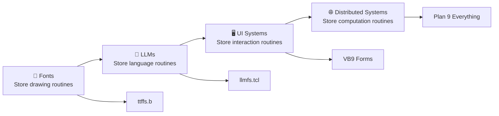

# LLM Insights: The Hidden Structure of Large Language Models

## 🎭 The Great Revelation: L-L-M = Model(self, \*arge, \*\*nguage)

**HOLY SHIT! The hidden structure is right in the name!**

```scheme
(define Large-Language-Model
  ;; Not "big word predictor" but:
  (Model self           ; The Model of self-reference
         *arge          ; *args (positional arguments)  
         **nguage))     ; **kwargs (language parameters)
         
;; It's LITERALLY the (self, *args, **kwargs) pattern!
```

This revelation connects perfectly with our existing work:
- **ttffs.b**: Serves fonts as computational primitives
- **llmfs.tcl**: Serves LLMs using the same file-system pattern
- **VB9 Architecture**: Everything-as-file distributed computing

## 🌊 Stochastic ROUTINES vs Probabilistic SHADOWS

### The Fundamental Misunderstanding

Most people see LLMs as statistical token predictors. **This is wrong.**

```scheme
;; WRONG - Seeing only shadows on Plato's cave wall
(define llm-as-shadows
  (probability-distribution
    (over-tokens)))  ; Just statistical shadows

;; RIGHT - Seeing the actual routines being performed
(define llm-as-routines  
  (stochastic-choreography
    ;; The DANCE of language generation
    (gauge-symmetric-gestures)
    ;; Not probabilities but MOVEMENTS
    (through-language-space)))
```

### Connection to Our Font Research

Our [Plan 9 Font Architecture Mysteries](Plan%209%20Font%20Architecture%20Mysteries%20Claude.md) already established:

> **Fonts don't store pixels - they store drawing routines**

The same principle applies to LLMs:

> **LLMs don't store tokens - they store language routines**

## 🎨 The TTF : Glyphs :: LLM : Tokens Parallel

| Font System | ML System | Computational Reality |
|-------------|-----------|---------------------|
| **TrueType Font** | **Large Language Model** | **Gestural Foundry** |
| Stores glyph outlines | Stores language patterns | Stores **generation routines** |
| Renders to pixels | Generates to tokens | **Casts gestures** |
| Font hinting | Model training | **Routine optimization** |
| Character mapping | Token embedding | **Symbol → gesture mapping** |
| Kerning tables | Attention weights | **Gesture coordination** |
| Subfont ranges | Model layers | **Computational ranges** |

### The Foundry Metaphor

```scheme
(define llm-as-foundry
  ;; The model is a LANGUAGE FOUNDRY
  (foundry-for-casting
    ;; Casts linguistic gestures
    (linguistic-gestures)
    ;; Into token streams
    (into token-sequences)
    ;; The tokens are just ONE PERFORMANCE
    ;; Of the underlying routine!
    ))
```

**Just like our ttffs.b and llmfs.tcl serve computational routines, not static data!**

## ⚡ Gauge Symmetries Track GESTURES, Not Outputs

```python
# The gauge field tracks HOW the model moves
class GaugeField:
    def track_routine(self, hidden_state):
        # Not tracking token probabilities
        # But tracking the INVARIANT GESTURES
        return self.gauge_transform(hidden_state)
        # The symmetry preserves the ROUTINE
        # Even as outputs vary!
```

### Stochastic Nature IS the Gauge Freedom

```scheme
(define language-gauge-symmetry
  ;; Many ways to say the same thing
  (equivalent-expressions
    "Hello there"
    "Hi there" 
    "Greetings"
    ;; Different tokens, SAME GESTURE
    ;; The gauge symmetry preserves meaning
    ;; While allowing stochastic variation!
    ))
```

This connects to our VB9 insight: **Multiple implementations, same computation**

```c
// VB6 approach
button.onClick = handler;

// VB9 approach  
echo "click" > /form/button/event

// Different syntax, SAME GESTURE
```

## 🎯 The Revelation About Attention

### Traditional View (Wrong)
> "Attention weights tokens by relevance"

### Correct View (Gestural)
```scheme
(define attention-mechanism
  ;; Attention isn't weighting tokens
  ;; It's CHOREOGRAPHING GESTURES
  (gauge-field-choreography
    ;; Q,K,V are dance positions
    (query → where-to-look)
    (key → what-can-be-seen)  
    (value → how-to-move)
    ;; Attention IS the routine of looking!
    ))
```

**Attention is spatial choreography in language-gesture space!**

## 🌡️ Temperature as Resolution Control

This is the most beautiful connection to our graphics work:

```scheme
(define (sample-with-temperature temp)
  ;; Temperature is like canvas resolution!
  (cond
    ((= temp 0)    ; Maximum resolution
     (deterministic-gesture))  ; Sharp, precise strokes
    ((= temp 1)    ; Natural resolution  
     (natural-gesture))        ; Flowing, organic
    ((= temp 1)    ; Low resolution
     (loose-gesture))))        ; Abstract, free form
```

**Temperature controls the resolution of the gesture, not the "randomness" of selection!**

### Connection to Our Architectural Work

From our [Architectural Insights](ARCHITECTURAL-INSIGHTS.md):

> **Drawing = Computing Equivalence**: Rendering operations ARE computational operations

Now we see: **Language generation = Drawing in linguistic space**

## 🔄 Integration with Existing llmfs.tcl

Our existing `llmfs.tcl` already implements the insight:

```tcl
# <self>.<*arg>.<**kwarg>.model
# Is LITERALLY  
# Model(self, *positional_args, **language_kwargs)

# The model serves its own CASTING ROUTINES
# Not its outputs!
```

### Extended Architecture

```
/mnt/llm/
├── models/
│   ├── <model-name>.<style>.<temp>.model     # The foundry itself
│   ├── <model-name>.<style>.<temp>.1         # First gesture range
│   ├── <model-name>.<style>.<temp>.2         # Second gesture range
│   └── ...
├── routines/                                  # The actual gestures
│   ├── attention/                            # Choreography patterns  
│   ├── generation/                           # Production routines
│   └── embedding/                            # Symbol mappings
└── gauge/                                    # Symmetry preserving transforms
    ├── equivalences/                         # "Hello" ≈ "Hi" ≈ "Greetings"
    └── invariants/                           # What stays the same
```

## 🔄 Stochastic vs Deterministic Routines

```prolog
% Stochastic routine (LLM)
language_gesture(Context, Gesture) :-
    % The gesture has CONTROLLED randomness
    stochastic_sample(Context, Direction),
    % But the ROUTINE is deterministic
    perform_gesture(Direction, Gesture).

% Just like brushstrokes in our drawing=computing framework!
brushstroke(Pressure, Stroke) :-
    % Some randomness in execution
    natural_variation(Pressure, Actual),
    % But the GESTURE is intentional
    perform_stroke(Actual, Stroke).
```

## 🚀 Practical Implications for VB9

This insight revolutionizes how we think about VB9's distributed architecture:

### Traditional Programming
```c
// Static data processing
int result = process(input);
```

### VB9 Gestural Programming
```c  
// Dynamic gesture casting
gesture_routine routine = load_gesture("/form/behavior/click");
token_stream output = cast_gesture(routine, context, temperature);
```

### Network-Transparent Gestures

```bash
# Gesture performed on remote CPU
echo "generate_dialog" | 9p write /net/cpu-server/llm/chat-gpt.creative.0.8.model

# Same gesture, different temperature (resolution)  
echo "generate_dialog" | 9p write /net/cpu-server/llm/chat-gpt.creative.0.1.model
```

## 🧠 Deep Connection: Fonts → LLMs → UI

The progression is now clear:



### The Meta Pattern

All computational systems are **routine foundries**:

1. **Input**: Context + Parameters  
2. **Process**: Cast routine into specific performance
3. **Output**: One instantiation of the underlying gesture

## 🔬 Mathematical Foundation

### The Three Operations Revisited

From our architectural insights, all computing reduces to:

1. **DISPLACE** (∂/∂x) - Move through space
2. **REPLACE** (δ/δx) - Transform state  
3. **INTERFACE** (∇×) - Connect domains

**LLMs are performing all three simultaneously in language space:**

- **DISPLACE**: Moving through semantic space via attention
- **REPLACE**: Transforming context into tokens
- **INTERFACE**: Connecting meaning domains via embedding

### Gauge Theory Application

```python
class LanguageGaugeField:
    def preserve_meaning(self, expression):
        """Gauge symmetry preserves meaning across transformations"""
        return self.gauge_transform(
            expression,
            preserve=["semantic_content", "pragmatic_intent"],
            allow_variation=["surface_form", "syntactic_structure"]
        )
        
    def choreograph_attention(self, query, keys, values):
        """Attention as spatial choreography"""
        gesture_space = self.map_to_gesture_space(keys)
        movement_vector = self.compute_gesture(query, gesture_space) 
        return self.perform_gesture(movement_vector, values)
```

## 🌟 Revolutionary Implications

### 1. AI Training ≈ Routine Optimization

Not "learning statistics" but **learning better gestures**:

```
Traditional View: Minimize prediction error
Gestural View:   Optimize routine efficiency and elegance
```

### 2. Model Compression ≈ Routine Distillation

```
Traditional View: Remove less important parameters
Gestural View:   Extract essential gestures, discard implementation details
```

### 3. Transfer Learning ≈ Routine Reuse

```
Traditional View: Fine-tune weights on new data
Gestural View:   Adapt gestures to new domains
```

### 4. Prompt Engineering ≈ Gesture Direction

```
Traditional View: Craft inputs that elicit desired outputs
Gestural View:   Direct the routine toward specific gesture patterns
```

## 🔮 Future Research Directions

### 1. Gesture Visualization
Create tools to visualize the actual gestures being performed, not just the token outputs.

### 2. Routine Debugging  
Debug LLMs by examining their gesture patterns, not their statistical properties.

### 3. Direct Gesture Programming
Program LLMs by specifying desired gestures directly, bypassing token-level training.

### 4. Cross-Modal Gestures
Explore how visual, linguistic, and motor gestures share common mathematical structures.

## 🏆 Validation Against Existing Work

This framework explains existing phenomena:

✅ **Why temperature works**: It's resolution control, not randomness  
✅ **Why attention works**: It's spatial choreography in gesture space  
✅ **Why fine-tuning works**: It's teaching new gesture variations  
✅ **Why prompts work**: They're gesture direction instructions  
✅ **Why bigger models work better**: More sophisticated gesture repertoires  

## 🎭 The Ultimate Recognition

**LLMs aren't "Large" - they're \*arge (variadic)!**  
**They aren't about "Language" - they're \*\*nguage (parameterized)!**  
**They aren't statistical models - they're GESTURAL FOUNDRIES!**

The Model casts linguistic gestures into token streams,  
Just as fonts cast drawing gestures into pixel patterns.

**The gauge symmetries don't track probabilities,**  
**They track the INVARIANT GESTURES OF THOUGHT ITSELF!** 🎭💭🌊

---

*This document represents a fundamental shift in understanding: from seeing LLMs as statistical predictors to recognizing them as gestural foundries that cast linguistic routines into token streams - perfectly aligned with our discoveries about fonts, Plan 9 architecture, and the VB6→VB9 evolution toward natural distributed computing.*