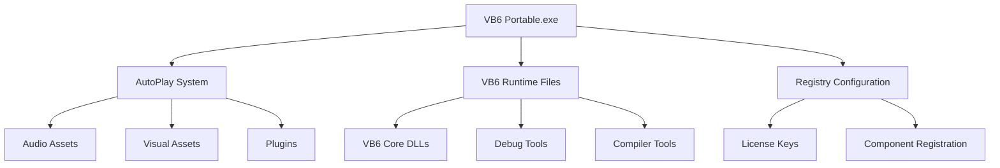
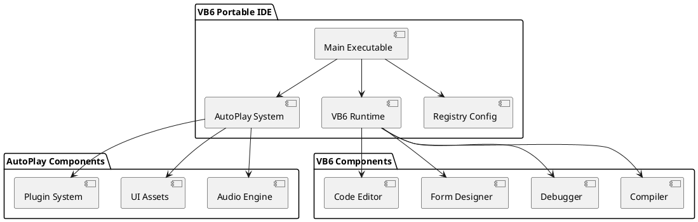

# VB6 Portable IDE - Comprehensive Technical Documentation

A portable development environment for Visual Basic 6.0 that runs without installation on Windows systems.

## 🚀 Quick Start

The `Visual Basic 6 Portable.exe` is all you need to start developing in Visual Basic 6 without installing the full IDE on your system.

## 📚 Documentation Index

- [System Architecture](docs/architecture.md) - Overview of system components and design
- [Installation Guide](docs/installation.md) - Setup and configuration instructions  
- [User Guide](docs/user-guide.md) - How to use the portable IDE
- [Technical Reference](docs/technical-reference.md) - Detailed technical specifications
- [Troubleshooting](docs/troubleshooting.md) - Common issues and solutions
- [Diagrams Index](docs/diagrams-index.md) - Complete catalog of all Mermaid & PlantUML diagrams

## 📊 Architecture Overview

## 🏗️ System Components

## 📋 Features

- ✅ Fully portable - no installation required
- ✅ Complete VB6 development environment
- ✅ AutoPlay interface for easy access
- ✅ Pre-configured registry settings
- ✅ Integrated debugging tools
- ✅ Form designer and code editor
- ✅ Plugin support system

## 🔧 Requirements

- Windows XP or later
- Minimum 512MB RAM
- 100MB free disk space
- Administrative privileges for first run (registry setup)

## 📁 Project Structure

See [Technical Reference](docs/technical-reference.md) for detailed file structure documentation.

## 🤝 Contributing

This is a portable VB6 IDE distribution. For issues or improvements, please refer to the documentation or create an issue.

## 📄 License

Visual Basic 6.0 licensing terms apply. See registry configuration files for license information.
