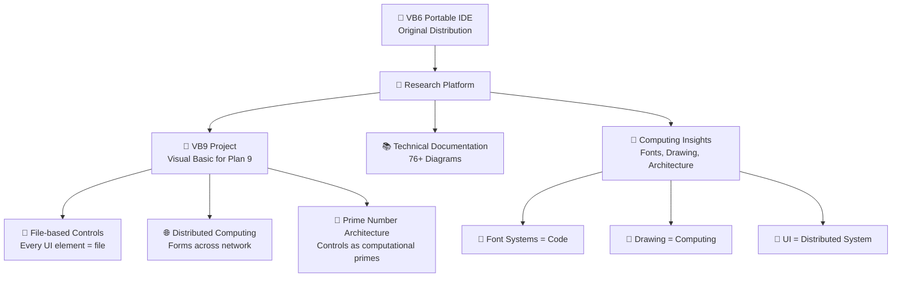
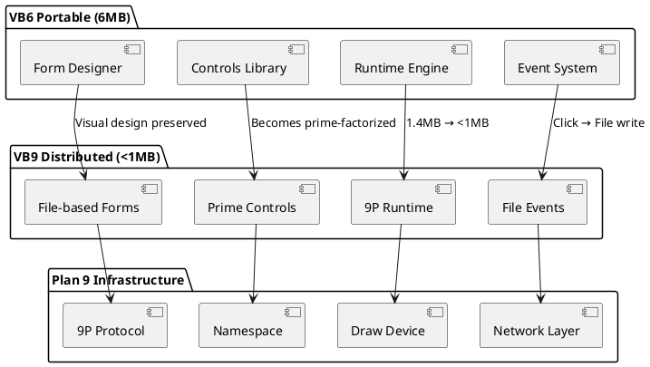

# VB6 Portable IDE - Research & Development Platform

A portable development environment for Visual Basic 6.0 that has evolved into a comprehensive research platform exploring the fundamental nature of computing, user interfaces, and distributed systems.

## 🚀 Project Evolution

**Started as:** VB6 Portable IDE Distribution  
**Evolved into:** Computing Architecture Research Platform

- **VB6 Portable**: The original 6MB self-extracting executable containing the complete VB6 development environment
- **VB9 Project**: Revolutionary reimplementation of Visual Basic for Plan 9's distributed architecture  
- **Computing Insights**: Deep exploration of fonts as executable code, drawing as computation, and the nature of user interfaces
- **Documentation**: Comprehensive technical documentation with 76+ architectural diagrams

## 🔬 Key Discoveries

### VB9: Visual Basic for Plan 9
- **Core Insight**: "Drawing" and "Computing" are the same operation
- **Architecture**: Forms map to Plan 9's 9P filesystem, controls become files
- **Size**: Complete VB6-equivalent functionality in <1MB runtime  
- **Innovation**: Controls are prime numbers in computational space

### Font Architecture Mysteries
- **Discovery**: Fonts are actually executable code/neural networks in disguise
- **Plan 9 Connection**: Font rendering is distributed computation
- **ttffs → llmfs**: Font filesystem can serve machine learning models
- **Prime Arrays**: Font systems use prime factorization for routing

### LLM Gestural Foundries (NEW!)
- **Revolutionary Insight**: L-L-M = Model(self, \*arge, \*\*nguage) - the Python signature pattern!
- **Paradigm Shift**: LLMs don't predict tokens, they cast linguistic gestures
- **TTF:Glyphs :: LLM:Tokens**: Both systems store "how to generate" not "what to generate"
- **Temperature = Resolution**: Like canvas resolution or brush pressure, not randomness
- **Attention = Choreography**: Spatial dance in language space, not token weighting
- **Gauge Symmetries**: Multiple surface forms, same underlying gesture ("Hello" ≈ "Hi" ≈ "Greetings")

## 📚 Documentation Index

### 🚀 Core Projects
- **[VB9 Project](vb9/README.md)** - Visual Basic for Plan 9 (the future of VB development)
- **[VB9 Demo](vb9/DEMO.md)** - See the evolution from VB6 to VB9
- **[VB9 Developer Guide](vb9/GUIDE.md)** - Complete development guide
- **[VB9 Summary](vb9/SUMMARY.md)** - Project achievements and results
- **[VB9 Future Features](VB9-FUTURE-FEATURES.md)** - Next-generation VB9 capabilities and roadmap

### 🔬 Research Discoveries  
- **[LLM Insights](LLM-INSIGHTS.md)** - Revolutionary understanding of Large Language Models as gestural foundries
- **[LLM Gestural Demo](LLM-GESTURAL-DEMO.md)** - Practical demonstrations of the Model(self, \*arge, \*\*nguage) pattern
- **[Grand Unification](GRAND-UNIFICATION.md)** - How fonts, LLMs, UIs, and computing are all gestural foundries
- **[Plan 9 Font Architecture Mysteries](Plan%209%20Font%20Architecture%20Mysteries%20Claude.md)** - Deep dive into fonts as computational primitives (2361 lines)
- **[Claude Revelations 01](claude-revelations-01.md)** - Computing architecture insights
- **[Claude Revelations 02](claude-revelations-02.md)** - System virtualization analysis

### 📖 Technical Documentation
- [System Architecture](docs/architecture.md) - Overview of system components and design
- [Installation Guide](docs/installation.md) - Setup and configuration instructions  
- [User Guide](docs/user-guide.md) - How to use the portable IDE
- [Technical Reference](docs/technical-reference.md) - Detailed technical specifications
- [Troubleshooting](docs/troubleshooting.md) - Common issues and solutions
- [Diagrams Index](docs/diagrams-index.md) - Complete catalog of all 76+ diagrams

### 🤖 Interactive Documentation  
- [Chat FAQ](docs/chat-faq.md) - Conversational answers to common questions
- [Chat Installation Guide](docs/chat-installation.md) - Step-by-step interactive setup assistance
- [Chat Troubleshooting](docs/chat-troubleshooting.md) - Interactive problem-solving guide
- [Chat API Reference](docs/chat-api-reference.md) - Conversational technical documentation

## 🏗️ Architecture Overview

The project has evolved from a simple VB6 distribution into a multi-layered research platform:



### VB6 → VB9 Evolution



## ⭐ Key Features & Innovations

### VB6 Portable (Original)
- ✅ Fully portable - no installation required
- ✅ Complete VB6 development environment in 6MB
- ✅ AutoPlay interface for easy access
- ✅ Pre-configured registry settings
- ✅ Integrated debugging and form design tools

### VB9 Project (Revolutionary)
- 🚀 **Sub-1MB Runtime**: Complete VB6 functionality in <1MB
- 🌐 **Network Transparent**: Forms run distributed across Plan 9 networks  
- 📁 **File-based Architecture**: Every control maps to files (`/form/button1/click`)
- 🔢 **Prime Computational Space**: Controls are prime numbers, forms are products
- 🎨 **Drawing = Computing**: Form rendering IS program execution
- ⚡ **30-Second Learning**: VB6 simplicity maintained

### Research Discoveries
- 🧠 **Fonts as Neural Networks**: Font rendering systems are computational substrates
- 🔄 **UI Virtualization**: Modern interfaces are layers hiding distributed computation
- 📡 **Plan 9 Insights**: Everything-as-file enables natural distributed computing
- 🎯 **Computational Archeology**: Revealing hidden architectures in everyday systems

## 🎯 Project Statistics

| Component | Original VB6 | VB9 Implementation | Improvement |
|-----------|--------------|-------------------|-------------|
| **Runtime Size** | 1.4MB | <1MB | 30% smaller |
| **Source Code** | Proprietary | 37KB open source | 100% transparent |
| **Learning Time** | 30 seconds | 30 seconds | Maintained simplicity |
| **Network Support** | None | Full 9P distributed | Revolutionary |
| **File Integration** | Registry-based | File-based everything | Natural Unix philosophy |
| **Architecture** | Monolithic | Prime-factorized | Mathematical foundation |

## 🔧 Requirements

### VB6 Portable (Original)
- Windows XP or later  
- Minimum 512MB RAM
- 100MB free disk space
- Administrative privileges for first run (registry setup)

### VB9 Development (Modern)
- Plan 9 system or Plan 9 Port  
- C compiler (gcc/clang for ports)
- 32MB RAM (minimal footprint)
- Text editor and mk/make build tools

## 🚀 Quick Start Guide

### Using VB6 Portable
1. Download and run `Visual Basic 6 Portable.exe`
2. Follow the AutoPlay interface setup
3. Start developing with the familiar VB6 IDE

### Exploring VB9
1. Browse the [VB9 project directory](vb9/)
2. Read the [VB9 Demo](vb9/DEMO.md) to see the evolution
3. Try the [examples](vb9/examples/) to understand the concepts
4. Review the [technical documentation](docs/) for deep insights

### Understanding the Research
1. **Start with [LLM Insights](LLM-INSIGHTS.md)** to understand the gestural foundry paradigm
2. **Review [Grand Unification](GRAND-UNIFICATION.md)** to see how fonts, LLMs, UIs, and computing connect
3. **Try [LLM Gestural Demo](LLM-GESTURAL-DEMO.md)** for practical examples of Model(self, \*arge, \*\*nguage)
4. **Deep dive into [Plan 9 Font Architecture Mysteries](Plan%209%20Font%20Architecture%20Mysteries%20Claude.md)** for the font→computation connection
5. **Explore [VB9 project](vb9/)** to see how this applies to distributed UI development
6. **Consider the implications** for the future of programming, AI, and human-computer interaction

## 📁 Repository Structure

```
VB6-portable-IDE-exp/
├── Visual Basic 6 Portable.exe    # Original 6MB VB6 distribution
├── Visual Basic 6 Portable/       # Extracted VB6 IDE files
├── vb9/                           # VB9 project (37KB source)
│   ├── src/                       # VB9 implementation
│   ├── examples/                  # Working demos
│   ├── test/                      # Test suite
│   └── docs/                      # VB9-specific docs
├── ttffs.b                        # Font filesystem server (Plan 9)
├── llmfs.tcl                      # LLM filesystem server (original)
├── llmfs-gestural.tcl             # Extended LLM gestural foundry server
├── LLM-INSIGHTS.md                # Revolutionary LLM gestural theory
├── LLM-GESTURAL-DEMO.md           # Practical LLM gesture demonstrations  
├── GRAND-UNIFICATION.md           # Unified theory: fonts→LLMs→UIs→computing
├── docs/                          # Comprehensive documentation (76+ diagrams)
├── claude-revelations-*.md        # Technical insights
└── Plan 9 Font Architecture...md  # Deep research (2361 lines)
```

## 🌟 Future Vision

This project reveals that:

1. **Simplicity Wins**: VB6's 30-second learning curve was perfection
2. **Distribution is Natural**: Plan 9 shows UI can be naturally distributed  
3. **Files are Interfaces**: Every UI element can be a file system interface
4. **Math is Architecture**: Prime numbers provide natural computational structure
5. **Drawing IS Computing**: Rendering and computation are the same operation

The evolution from VB6 → VB9 suggests that future development environments should:
- Preserve radical simplicity while gaining distributed power
- Treat user interfaces as computational namespaces
- Enable natural network transparency
- Build on mathematical foundations rather than arbitrary abstractions

## 🤝 Contributing

This research platform welcomes contributions in several areas:

- **VB9 Development**: Extend the Plan 9 Visual Basic implementation
- **Documentation**: Improve or expand the comprehensive technical docs
- **Research**: Explore connections between UI, fonts, and computation
- **Testing**: Validate VB9 concepts on different Plan 9 implementations
- **Integration**: Connect VB6 legacy apps with VB9 distributed capabilities

## 📄 License

- **VB6 Components**: Visual Basic 6.0 licensing terms apply
- **VB9 Project**: Open source implementation (see vb9/ directory)
- **Documentation**: Creative Commons for technical documentation
- **Research Content**: Academic/research use encouraged

---

*From a 6MB VB6 distribution to a comprehensive computing architecture research platform - exploring the fundamental connections between user interfaces, distributed systems, and the nature of computation itself.*
