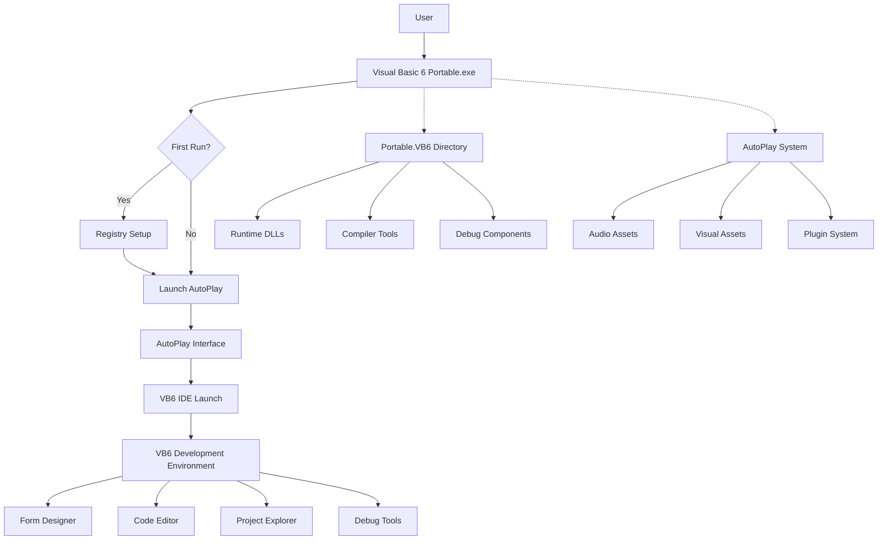
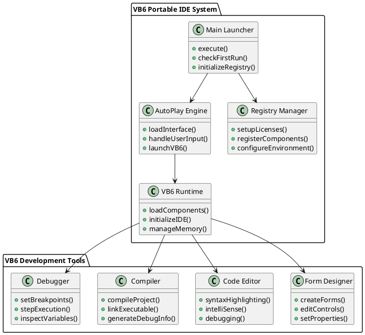
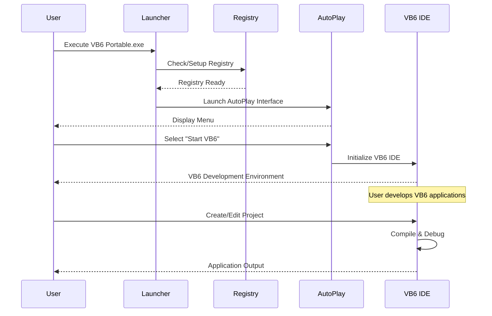
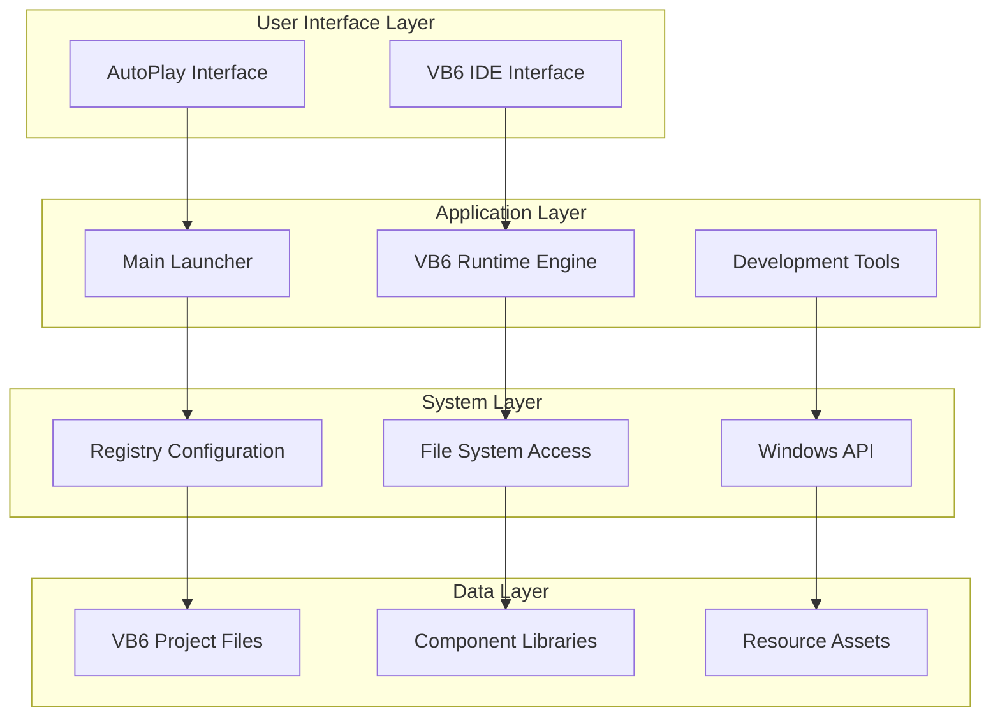
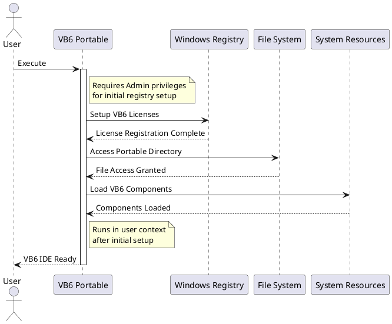

# System Architecture

## Overview

The VB6 Portable IDE is designed as a self-contained development environment that provides all necessary components for Visual Basic 6.0 development without requiring system-wide installation.

## Architecture Diagram

## Component Architecture

## Data Flow

## System Layers

## Security Model

## Performance Characteristics

### Memory Usage
- **Base Memory**: ~50MB for launcher and AutoPlay
- **VB6 IDE**: ~100-200MB depending on project size
- **Peak Usage**: ~300MB for large projects with debugging

### Disk Usage
- **Portable Package**: ~100MB total
- **Runtime Footprint**: Minimal temp files
- **Project Storage**: User-defined location

### Startup Time

```mermaid
gantt
    title VB6 Portable Startup Sequence
    dateFormat X
    axisFormat %s
    
    section Initialization
    Launch Executable    :done, launch, 0, 1s
    Registry Check      :done, registry, after launch, 2s
    AutoPlay Loading    :done, autoplay, after registry, 1s
    
    section VB6 Launch
    Component Loading   :active, components, after autoplay, 3s
    IDE Initialization  :ide, after components, 2s
    Ready for Use      :milestone, after ide, 0s
```

## Integration Points

The system integrates with Windows through several key interfaces:

1. **Registry Integration**: License and component registration
2. **File System**: Portable directory structure
3. **Windows API**: GUI and system resource access
4. **Process Management**: Multiple VB6 tool processes

## Scalability Considerations

- **Single User**: Designed for individual developer use
- **Project Size**: Handles small to medium VB6 projects efficiently
- **Resource Scaling**: Memory usage scales with project complexity
- **Concurrent Access**: Limited to single IDE instance per portable installation