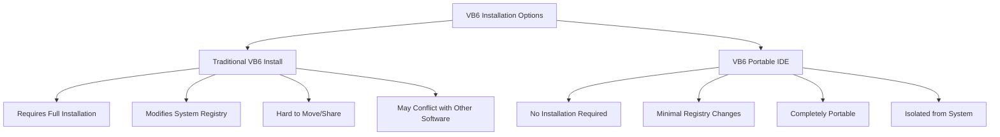
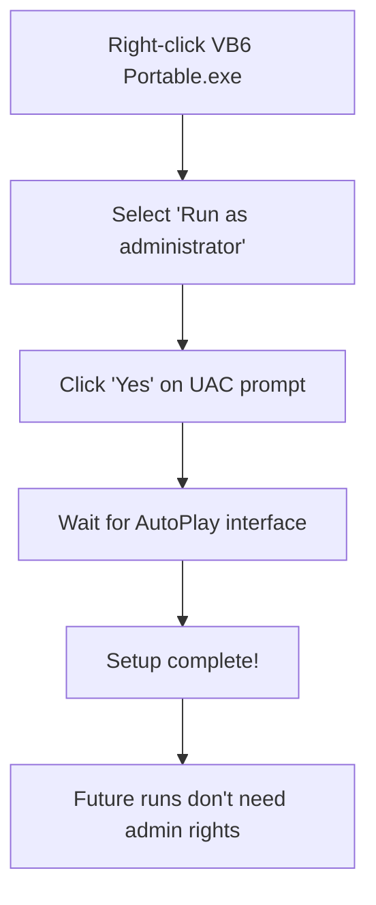
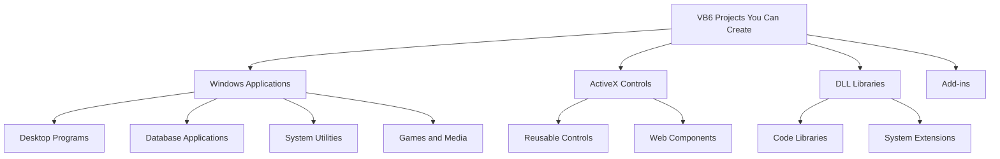
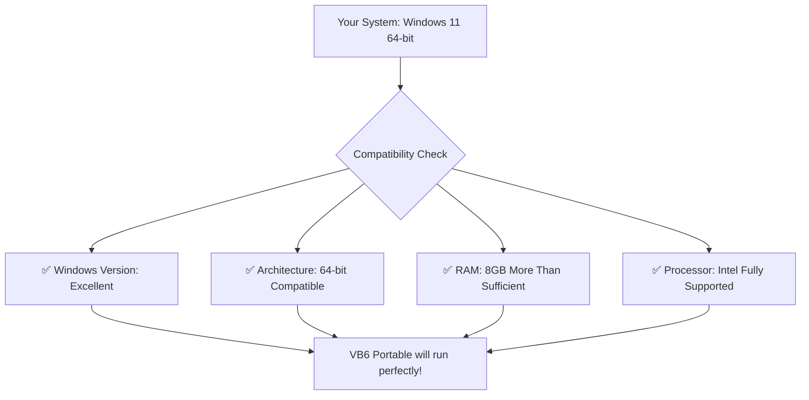
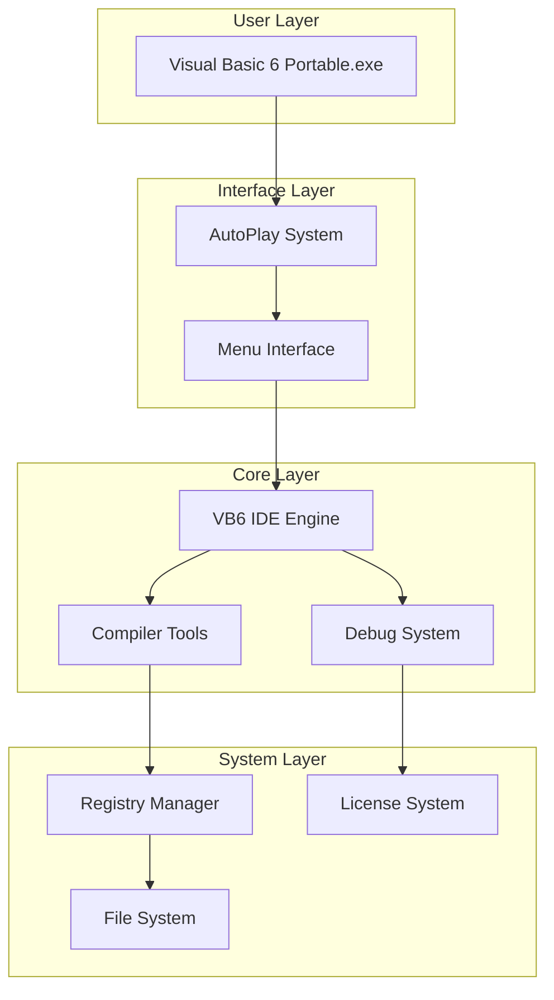
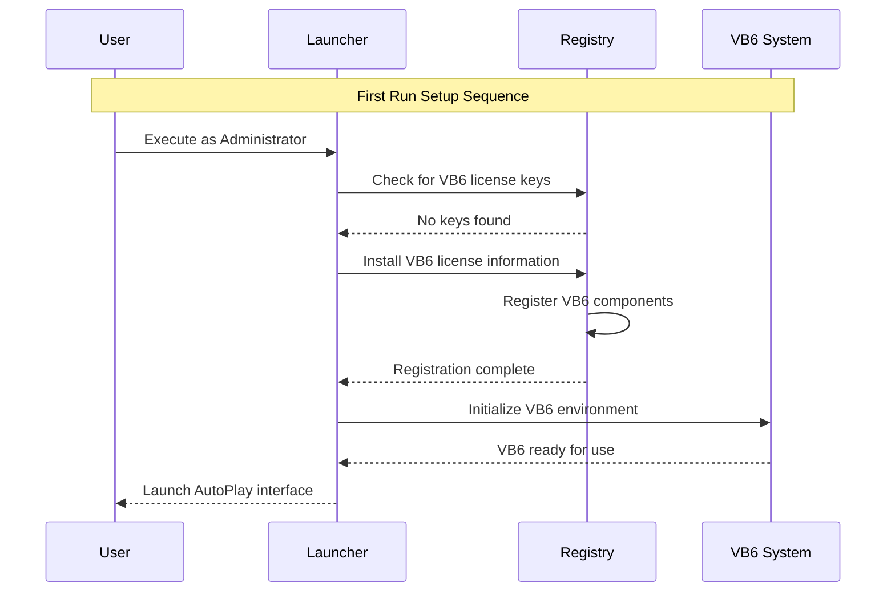

# Interactive Chat FAQ System

Welcome to the VB6 Portable IDE Conversational FAQ! Get instant answers to your questions through this interactive chat-style guide.

## 🤖 Chat with the FAQ Assistant

### Getting Started Conversation

**You**: Hi! I'm new to VB6 Portable IDE. Can you help me?

**Assistant**: Absolutely! Welcome to VB6 Portable IDE. I'm here to answer all your questions. Let's start with the basics - what would you like to know about?

**Common first questions**:
- "What is VB6 Portable IDE?" → [About VB6 Portable](#about-vb6-portable-chat)
- "How do I install it?" → [Installation Chat](#installation-chat)
- "What can I do with it?" → [Features Chat](#features-chat)  
- "Do I need a license?" → [Licensing Chat](#licensing-chat)
- "Will it work on my computer?" → [System Requirements Chat](#system-requirements-chat)

---

## About VB6 Portable Chat

**You**: What exactly is VB6 Portable IDE?

**Assistant**: Great question! VB6 Portable IDE is a complete Visual Basic 6.0 development environment that doesn't require installation on your computer.

**Think of it like this**:
- 📁 **Portable**: Runs from any folder, USB drive, or network location  
- 🔧 **Complete**: Includes IDE, compiler, debugger, and all tools
- ⚡ **Ready-to-use**: No setup or configuration required
- 🛡️ **Safe**: Doesn't modify your system (after initial registry setup)

**You**: How is this different from installing regular VB6?

**Assistant**: Excellent follow-up question! Here are the key differences:



**Traditional VB6**:
- ❌ Full system installation required
- ❌ Modifies system registry extensively
- ❌ Difficult to move between computers
- ❌ May have compatibility issues

**VB6 Portable IDE**:
- ✅ Extract and run immediately  
- ✅ Only adds necessary license keys
- ✅ Copy folder to any computer and use
- ✅ Isolated from other software

**You**: That sounds perfect! Can I use it for commercial development?

**Assistant**: For commercial development, you need to ensure you have proper Visual Basic 6.0 licensing from Microsoft. VB6 Portable IDE provides the tools, but licensing compliance is your responsibility.

**Recommended approach**:
1. Verify your VB6 license status
2. Use VB6 Portable for development convenience  
3. Follow Microsoft's licensing terms for distribution

Want to know more about [licensing details](#licensing-chat)?

---

## Installation Chat

**You**: How do I install VB6 Portable IDE?

**Assistant**: Here's the beautiful part - there's no traditional "installation"! Let me walk you through the simple setup:

**Step-by-Step Conversation**:

**Step 1**: **Download Complete**
**You**: I've downloaded `Visual Basic 6 Portable.exe`

**Assistant**: Perfect! Now you just need to extract it. Here's what to do:

1. **Create a folder** where you want VB6 (e.g., `C:\Dev\VB6Portable`)
2. **Copy the .exe file** to that folder  
3. **Double-click** `Visual Basic 6 Portable.exe`

**You**: I double-clicked it, but got a permission error.

**Assistant**: Ah, that's expected! The first run needs administrator privileges to set up VB6 licenses. Here's how to fix it:



**Step 2**: **First Launch**
**You**: Okay, I ran as administrator and see a menu interface.

**Assistant**: Excellent! That's the AutoPlay interface. You're seeing the main menu because setup was successful. The registry configuration is now complete.

**What you're seeing**:
- 🎵 **Audio/Visual Interface**: The AutoPlay CD-style menu
- 🚀 **Start VB6 Option**: Click this to launch the IDE
- 📚 **Documentation Links**: Access to help and guides
- 🔧 **Additional Tools**: Various VB6 utilities

**Step 3**: **Launch VB6 IDE**
**You**: I clicked "Start VB6" and the Visual Basic IDE opened!

**Assistant**: Perfect! You're now ready for VB6 development. From now on:

- ✅ **No admin rights needed** for normal use
- ✅ **Portable**: Copy the entire folder anywhere  
- ✅ **Complete environment**: Everything you need is included

**You**: Can I move this to a USB drive?

**Assistant**: Absolutely! That's one of the best features:

1. **Copy the entire folder** to your USB drive
2. **Run from USB** on any Windows computer  
3. **Same experience** everywhere you go
4. **No additional setup** needed on other computers

**Note**: The first run on each new computer will still need admin rights for license setup.

---

## Features Chat  

**You**: What can I actually do with VB6 Portable IDE?

**Assistant**: VB6 Portable IDE gives you the complete Visual Basic 6.0 development experience! Let me show you what's included:

### Core Development Features

**Form Designer**:
- 🎨 **Visual interface design**
- 🔧 **Drag-and-drop controls**  
- 📐 **Precise positioning and sizing**
- 🎯 **Property editing**

**Code Editor**:
- ✏️ **Syntax highlighting**
- 💡 **IntelliSense support**
- 🔍 **Find and replace**
- 📝 **Multiple file editing**

**You**: Can I create actual Windows programs with it?

**Assistant**: Yes! You can create full Windows applications:



**Application Types**:
- **Standard EXE**: Regular Windows programs
- **ActiveX EXE**: COM servers and components
- **ActiveX DLL**: In-process servers  
- **ActiveX Control**: Reusable UI controls

**You**: What about debugging? Can I debug my programs?

**Assistant**: Absolutely! VB6 Portable includes the complete debugging toolkit:

**Debugging Features**:
- 🔴 **Breakpoints**: Pause execution at specific lines
- 🎯 **Step-through**: Execute code line by line
- 👁️ **Watch variables**: Monitor values in real-time
- 📋 **Immediate window**: Test code snippets instantly
- 📊 **Call stack**: See function call hierarchy

**Debug Workflow**:
1. Set breakpoints in your code
2. Run project in debug mode (F5)
3. When breakpoint hits, examine variables
4. Step through code (F8) or continue (F5)

**You**: This sounds like everything I need! What about database access?

**Assistant**: Yes! VB6 Portable supports database development:

**Database Technologies Supported**:
- 💾 **ADO (ActiveX Data Objects)**: Modern database access
- 🗄️ **DAO (Data Access Objects)**: Traditional Access/Jet databases  
- 🔌 **ODBC**: Connect to various database systems
- 📊 **RDO (Remote Data Objects)**: Server database access

**Common Database Tasks**:
- Connect to SQL Server, MySQL, Oracle, Access
- Create data-bound forms and controls
- Generate reports and queries
- Build multi-tier applications

---

## System Requirements Chat

**You**: Will VB6 Portable work on my computer?

**Assistant**: Let me help you check! VB6 Portable is quite compatible, but let's verify your system:

**Your System Information Needed**:
- What version of Windows are you running?
- Is it 32-bit or 64-bit?  
- How much RAM do you have?
- What processor (Intel/AMD)?

**You**: I have Windows 11, 64-bit, Intel i5, 8GB RAM

**Assistant**: Perfect! Your system is ideal for VB6 Portable IDE:



**Your System Rating**: ⭐⭐⭐⭐⭐ (5/5 stars)
- **OS**: Windows 11 - Fully supported
- **Memory**: 8GB - Plenty for VB6 development
- **Processor**: Intel i5 - Great performance

**You**: What about older systems? I have an old laptop with Windows 7.

**Assistant**: VB6 Portable works great on older systems too! Let's check:

**Windows 7 Compatibility**:
- ✅ **Fully Supported**: VB6 was designed for this era
- ✅ **Better Performance**: Often runs faster than on Windows 11
- ✅ **Fewer Compatibility Issues**: Native environment for VB6

**Minimum System Requirements**:
- **Windows**: XP or later (7, 8, 10, 11 all supported)
- **RAM**: 512MB minimum, 2GB+ recommended  
- **Disk**: 100MB free space
- **Processor**: Any Intel/AMD x86 processor

**Optimal Performance**:
- **RAM**: 4GB+ for comfortable development
- **Disk**: SSD recommended for faster loading
- **Display**: 1024x768 or higher

**You**: What if I'm using a Mac or Linux?

**Assistant**: VB6 Portable is Windows-only, but you have options for Mac/Linux:

**Mac Users**:
- 🖥️ **Parallels Desktop**: Run Windows in a virtual machine
- 🎮 **Boot Camp**: Dual-boot Windows natively
- ☁️ **Windows VM**: VMware Fusion or VirtualBox

**Linux Users**:  
- 🍷 **Wine**: Run Windows applications on Linux
- 📦 **VirtualBox**: Windows virtual machine
- ☁️ **VMware**: Professional virtualization

**Wine Compatibility Note**: VB6 Portable has been tested with Wine and works reasonably well for development (though some features may be limited).

---

## Licensing Chat

**You**: Do I need to buy a license to use VB6 Portable IDE?

**Assistant**: This is an important question about legal compliance. Let me explain the licensing situation:

**VB6 Portable IDE Package**:
- 🔧 **Tools**: The IDE, compiler, and runtime are included
- 📋 **Licenses**: You need valid VB6 licensing from Microsoft
- ⚖️ **Compliance**: Your responsibility to ensure legal use

**You**: I don't have an original VB6 license. Can I still use this?

**Assistant**: For legal compliance, you should have proper Visual Basic 6.0 licensing from Microsoft. Here are your options:

**Legal Licensing Paths**:
1. **Original VB6**: If you have old VB6 media/license
2. **MSDN Subscription**: Includes VB6 licensing rights
3. **Volume Licensing**: For business/enterprise use
4. **Educational**: Academic licensing for students

**What This Means**:
- 🎓 **Learning**: You can explore and learn VB6 concepts
- 💼 **Commercial Use**: Requires proper Microsoft licensing  
- 🏢 **Business Development**: Must comply with enterprise licensing
- 📚 **Educational**: Check if your institution has VB6 licenses

**You**: I have an old VB6 CD from years ago. Is that sufficient?

**Assistant**: If you have a legitimate VB6 CD with proper licensing, then yes! That's exactly what you need:

**Your Original VB6 License Covers**:
- ✅ **Using VB6 tools** (IDE, compiler, debugger)
- ✅ **Developing applications** for personal/business use  
- ✅ **Distributing your applications** (following license terms)
- ✅ **Using VB6 Portable** as an alternative deployment of your licensed tools

**VB6 Portable Advantage**:
- Same tools as your CD, but more convenient
- No need to install from CD each time  
- Portable and modern deployment
- Your existing license covers this usage

**You**: What about the runtime files? Can I distribute my applications?

**Assistant**: Great question! Runtime distribution depends on your VB6 license terms:

**Runtime Distribution Rights**:
- 📦 **VB6 Runtime**: Usually included with proper VB6 license
- 🚀 **Your Applications**: You can distribute programs you create
- 🔧 **Required DLLs**: Bundle necessary runtime files with your apps
- 📋 **License Compliance**: Follow Microsoft's distribution guidelines

**Common Runtime Files You Can Distribute**:
- `MSVBVM60.DLL` (VB6 runtime)
- `MSVCRT.DLL` (C runtime)  
- `OLEAUT32.DLL` (OLE automation)
- Component-specific DLLs

**Recommendation**: Review your original VB6 license documentation for specific distribution rights and requirements.

---

## Troubleshooting Quick Chat

**You**: Something's not working right. Can you help quickly?

**Assistant**: Of course! Let's get you back up and running. What's the issue?

**Quick Problem Categories**:
- 🚫 **Won't Start**: Permission or file issues → [Quick Start Fix](#quick-start-fix)
- 🐌 **Running Slow**: Performance problems → [Quick Speed Fix](#quick-speed-fix)  
- ⚠️ **Error Messages**: Specific errors → [Quick Error Fix](#quick-error-fix)
- 🔧 **Compilation Issues**: Build problems → [Quick Compile Fix](#quick-compile-fix)

### Quick Start Fix
**You**: VB6 Portable won't start at all.

**Assistant**: Let's get this fixed in 30 seconds:

1. **Right-click** `Visual Basic 6 Portable.exe`
2. **Select** "Run as administrator"
3. **Click** "Yes" when prompted
4. **Wait** for AutoPlay menu (30-60 seconds)

**Still not working?** → Check our [detailed troubleshooting chat](chat-troubleshooting.md)

### Quick Speed Fix  
**You**: Everything is running really slowly.

**Assistant**: Quick performance boost:

1. **Close** other applications (especially browsers)
2. **Check** Task Manager - is VB6.exe using >300MB RAM?
3. **Restart** VB6 Portable if memory usage is high
4. **Consider** smaller project files if working with large projects

**Need more help?** → See [performance optimization chat](chat-troubleshooting.md#performance-issues-chat)

### Quick Error Fix
**You**: I'm getting a specific error message.

**Assistant**: What does the error say? Here are instant fixes for common messages:

**"Permission denied"** → Run as Administrator  
**"File not found"** → Check file integrity, re-extract if needed
**"User-defined type not defined"** → Check Project → References for missing items
**"License not found"** → Run setup as Administrator again

**Still stuck?** → Use our [interactive error solver](chat-troubleshooting.md)

### Quick Compile Fix
**You**: My project won't compile.

**Assistant**: Fast compilation fix:

1. **Check** Project → References for "MISSING" items
2. **Uncheck** any missing references  
3. **Save** and try compiling again
4. **If still failing** → Check for syntax errors in code

**Complex compilation issues?** → Try our [compilation troubleshooting chat](chat-troubleshooting.md#compilation-issues-chat)

---

## Advanced Questions Chat

**You**: I have some technical questions about VB6 Portable's architecture.

**Assistant**: I love technical questions! What would you like to know about the internals?

**Technical Topics Available**:
- 🏗️ **Architecture**: How VB6 Portable is structured
- 📁 **File Organization**: What's in each directory
- 🔧 **Registry Setup**: How licenses are configured  
- 🚀 **AutoPlay System**: How the interface works
- 💾 **Portability**: How it achieves zero-installation operation

### Architecture Discussion
**You**: How is VB6 Portable structured internally?

**Assistant**: Excellent question! VB6 Portable uses a sophisticated multi-layer architecture:



**Key Components**:
- **Launcher**: Self-extracting executable with embedded files
- **AutoPlay**: CD-style interface system  
- **VB6 Core**: Complete IDE, compiler, and runtime
- **Registry Layer**: Minimal system integration for licensing

**You**: How does it achieve portability without installation?

**Assistant**: Great follow-up! VB6 Portable uses several clever techniques:

**Portability Mechanisms**:
1. **Self-Contained Files**: All VB6 tools bundled in one package
2. **Registry Isolation**: Only essential license keys added to registry
3. **Relative Paths**: All internal references use relative file paths
4. **Embedded Resources**: Icons, sounds, and assets included internally
5. **Runtime Loading**: DLLs loaded dynamically from portable directory

**Why This Works**:
- VB6 was designed to be relocatable (pre-Windows Installer era)
- Most VB6 components can run from any directory
- Only licensing requires registry integration
- AutoPlay system provides consistent launch experience

**You**: What happens during the first-run setup?

**Assistant**: During first run, VB6 Portable performs minimal system integration:



**Registry Changes Made**:
- VB6 license keys (required for IDE operation)
- Component registration (for ActiveX controls)
- File type associations (optional, for .vbp files)

**What's NOT Changed**:
- No Program Files installation
- No Start Menu items
- No system PATH modifications  
- No global DLL registration

This is why subsequent runs don't need admin rights!

---

## Getting Started Success Path

**You**: I'm convinced! Walk me through getting started successfully.

**Assistant**: Fantastic! Let me guide you through a complete successful setup and first project:

### Complete Success Journey

**Phase 1: Setup (5 minutes)**

**Step 1**: Download and Extract
- Create folder: `C:\Dev\VB6Portable`
- Copy `Visual Basic 6 Portable.exe` there
- Right-click → "Run as administrator"
- Wait for AutoPlay interface

**You**: ✅ AutoPlay interface appeared!

**Assistant**: Perfect! Phase 1 complete. Moving to Phase 2...

**Phase 2: First Launch (2 minutes)**

**Step 2**: Launch VB6 IDE
- Click "Start VB6" in AutoPlay menu
- Wait for VB6 IDE to load (30-60 seconds)
- You should see the VB6 New Project dialog

**You**: ✅ VB6 IDE is open with New Project dialog!

**Assistant**: Excellent! You're now ready for development. Let's create your first project...

**Phase 3: First Project (10 minutes)**

**Step 3**: Create Hello World Application
- Select "Standard EXE" → OK
- You'll see Form1 with a gray form designer
- From the toolbox, double-click "CommandButton"  
- Double-click the button on the form

**You**: ✅ I'm in the code editor with a Button1_Click subroutine!

**Assistant**: Perfect! Now add this code inside the subroutine:

```vb
Private Sub Command1_Click()
    MsgBox "Hello from VB6 Portable!", vbInformation, "Success!"
End Sub
```

**Step 4**: Test Your Application
- Press F5 to run the project
- Click the button on your form
- You should see a message box!

**You**: ✅ It works! I see the "Hello from VB6 Portable!" message!

**Assistant**: 🎉 **Congratulations!** You've successfully:
- Set up VB6 Portable IDE
- Launched the development environment  
- Created your first VB6 application
- Compiled and tested working code

**Phase 4: Next Steps**

You're now ready for serious VB6 development! Recommended next steps:

1. **Explore the IDE**: Try the form designer, project explorer, properties window
2. **Create a Real Project**: Database app, utility tool, or game
3. **Learn VB6 Syntax**: Leverage your existing programming knowledge  
4. **Build and Distribute**: Create .exe files for others to use

**You**: This was easier than I expected! Thank you!

**Assistant**: You're very welcome! VB6 Portable IDE makes VB6 development accessible and convenient. You now have a complete, portable development environment that you can take anywhere.

**Quick Reference for Future Use**:
- **Normal Launch**: Just double-click `Visual Basic 6 Portable.exe` (no admin needed)
- **Portable Usage**: Copy entire folder to USB/network drive
- **Project Files**: Save .vbp files anywhere you like
- **Help Available**: Use this chat FAQ anytime you need assistance

Happy VB6 development! 🚀

---

*This interactive FAQ provides conversational support for all aspects of VB6 Portable IDE usage. For comprehensive technical details, see our [complete documentation suite](README.md).*