# Interactive Chat Installation Guide

Welcome to the VB6 Portable IDE Interactive Installation Assistant! This conversational guide will walk you through the complete setup process step by step.

## 🤖 Installation Chat Assistant

### Welcome Conversation

**Assistant**: Hello! I'm your VB6 Portable IDE installation assistant. I'll help you get VB6 up and running on your system quickly and easily.

**Assistant**: Before we begin, let me ask: Is this your first time setting up VB6 Portable IDE?

**Your Options**:
- "Yes, this is my first time" → [First-Time Setup Chat](#first-time-setup-chat)
- "I've used it before but need to reinstall" → [Reinstallation Chat](#reinstallation-chat)
- "I'm setting it up on a new computer" → [New Computer Setup Chat](#new-computer-setup-chat)
- "I want to set it up on a USB drive" → [USB Portable Setup Chat](#usb-portable-setup-chat)

---

## First-Time Setup Chat

**You**: Yes, this is my first time setting up VB6 Portable IDE.

**Assistant**: Perfect! I'll guide you through everything step by step. VB6 Portable IDE is designed to be incredibly easy to set up - there's no traditional "installation" process like other software.

**Assistant**: First, let me check - do you already have the `Visual Basic 6 Portable.exe` file downloaded?

### Download Phase

**You**: No, I don't have the file yet.

**Assistant**: No problem! Here's what you need to do:

1. **Download the file** from your source
2. **Check the file size** - it should be approximately 6MB
3. **Verify it's named** `Visual Basic 6 Portable.exe`

**You**: I have the file now. It's 6MB and named correctly.

**Assistant**: Excellent! Now we can begin the setup process. Let's choose where to put VB6 Portable on your computer.

### Location Selection Phase

**Assistant**: Where would you like to set up VB6 Portable IDE? Here are some popular options:

**Recommended Locations**:
- `C:\Dev\VB6Portable` (Good for development work)
- `C:\Tools\VB6Portable` (Good for system tools)  
- `D:\Programs\VB6Portable` (If you have a separate programs drive)
- Desktop folder (For quick access)

**You**: I'll use `C:\Dev\VB6Portable`

**Assistant**: Great choice! That's a professional development setup. Let's create that directory:

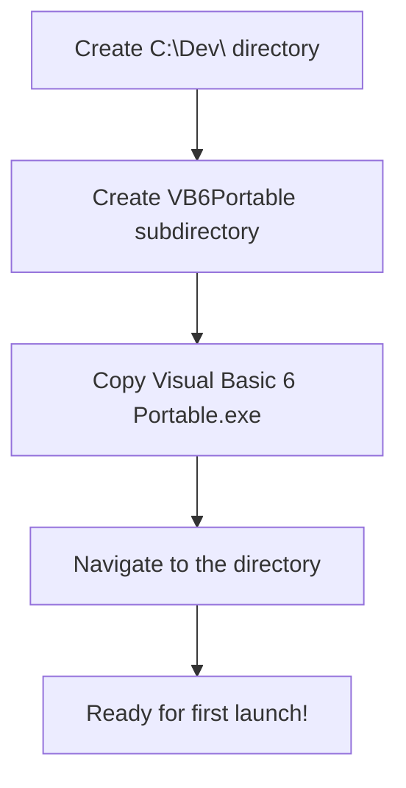

**Steps to Follow**:
1. **Open File Explorer**
2. **Navigate to C:\ drive**
3. **Create "Dev" folder** (if it doesn't exist)
4. **Create "VB6Portable" folder** inside Dev
5. **Copy your .exe file** into `C:\Dev\VB6Portable\`

**You**: Done! The file is now in `C:\Dev\VB6Portable\Visual Basic 6 Portable.exe`

**Assistant**: Perfect! Now comes the important part - the first launch. This is where VB6 Portable sets up the necessary registry entries for VB6 licensing.

### First Launch Phase

**Assistant**: For the first launch, you'll need administrator privileges. This is only required once to set up VB6 licenses in the Windows registry.

**Important**: After this first setup, you won't need administrator rights for normal use.

**You**: Okay, I'm ready. What do I do?

**Assistant**: Here's the exact process:

1. **Navigate to** `C:\Dev\VB6Portable\`
2. **Right-click** on `Visual Basic 6 Portable.exe`
3. **Select** "Run as administrator"
4. **Click "Yes"** when Windows asks for permission

**You**: I right-clicked and selected "Run as administrator", but nothing seems to happen.

**Assistant**: That's normal! The first launch can take 30-90 seconds because it's:
- Setting up the Wine configuration (if applicable)
- Installing VB6 license keys in the registry
- Initializing the AutoPlay system
- Preparing all VB6 components

**What to expect**:
- First 30 seconds: No visible activity (normal)
- After 30-90 seconds: AutoPlay interface should appear
- You may see some Windows dialogs briefly

**You**: After about a minute, I see a colorful interface with menu options!

**Assistant**: 🎉 **Success!** That's the AutoPlay interface, which means the registry setup completed successfully. You're seeing the main menu of VB6 Portable IDE.

### AutoPlay Interface Exploration

**Assistant**: Let me explain what you're seeing in the AutoPlay interface:

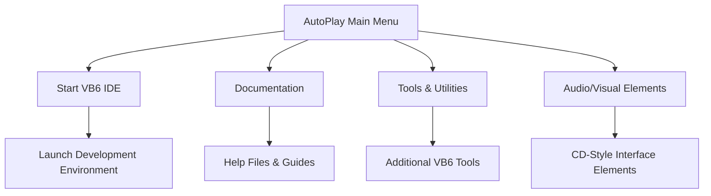

**Main Options You'll See**:
- 🚀 **Start VB6**: Launches the Visual Basic IDE
- 📚 **Documentation**: Access help and guides
- 🔧 **Tools**: Additional VB6 utilities
- ❌ **Exit**: Close the AutoPlay interface

**You**: I see those options. Should I click "Start VB6" now?

**Assistant**: Absolutely! That's exactly what we want to do. Click "Start VB6" to launch the Visual Basic development environment.

### VB6 IDE Launch Phase

**You**: I clicked "Start VB6" and now I see the Visual Basic 6.0 IDE opening!

**Assistant**: 🎉 **Congratulations!** You have successfully set up VB6 Portable IDE! The development environment is now ready for use.

**What you should see**:
- **VB6 IDE Window**: The main Visual Basic development interface
- **New Project Dialog**: Asking what type of project to create
- **Toolbox**: Various controls like buttons, text boxes, etc.
- **Project Explorer**: For managing your project files

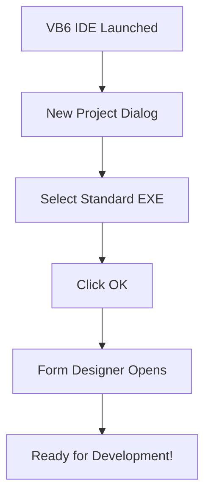

**You**: Yes, I see all of that! There's a "New Project" dialog asking me what type of project I want.

**Assistant**: Perfect! For your first project, select "Standard EXE" (which creates a Windows application) and click "OK".

**You**: I selected Standard EXE and clicked OK. Now I see a gray form with a grid and various tool windows around it.

**Assistant**: Excellent! You're now in the VB6 development environment. What you're seeing is:

- **Form Designer**: The gray window with grid (where you design your UI)
- **Toolbox**: Panel with buttons, text boxes, and other controls
- **Properties Window**: Shows properties of selected items
- **Project Explorer**: Shows files in your current project

### Setup Verification

**Assistant**: Let's do a quick test to make sure everything is working perfectly. We'll create a simple "Hello World" program:

**Test Steps**:
1. **Double-click the "CommandButton" icon** in the toolbox
2. **Click anywhere on the gray form** to place a button
3. **Double-click the button you just placed**

**You**: I did those steps and now I'm in a code editor window with some code already there.

**Assistant**: Perfect! You should see something like:

```vb
Private Sub Command1_Click()

End Sub
```

**Now type this line between the parentheses**:
```vb
MsgBox "VB6 Portable IDE is working!", vbInformation, "Success"
```

**You**: I typed that code. What's next?

**Assistant**: Now let's test it! Press **F5** on your keyboard to run your program.

**You**: I pressed F5 and a window appeared with a button on it!

**Assistant**: Great! Now click the button on that window.

**You**: I clicked the button and saw a message box saying "VB6 Portable IDE is working!"

**Assistant**: 🎉 **PERFECT!** Your VB6 Portable IDE setup is completely successful! You have:

✅ **Successfully extracted** the portable package  
✅ **Completed registry setup** with administrator privileges  
✅ **Launched the AutoPlay interface** correctly  
✅ **Started the VB6 IDE** successfully  
✅ **Created and tested** a working VB6 program  

### Post-Setup Information

**Assistant**: Now that setup is complete, here's what you need to know going forward:

**For Daily Use**:
- **No admin rights needed**: Just double-click `Visual Basic 6 Portable.exe`
- **Direct access**: The AutoPlay menu will appear immediately  
- **Fast startup**: Registry is already configured

**Your Setup Location**:
- **Main executable**: `C:\Dev\VB6Portable\Visual Basic 6 Portable.exe`
- **Extracted files**: `C:\Dev\VB6Portable\Visual Basic 6 Portable\`
- **VB6 IDE**: Accessible through AutoPlay → Start VB6

**You**: This was much easier than I expected! Can I create a desktop shortcut?

**Assistant**: Absolutely! Here's how to create a convenient shortcut:

1. **Right-click your desktop** → New → Shortcut
2. **Browse to**: `C:\Dev\VB6Portable\Visual Basic 6 Portable.exe`
3. **Name it**: "VB6 Portable IDE"
4. **Click Finish**

Now you can launch VB6 Portable directly from your desktop!

**You**: Perfect! Thank you for walking me through this step by step.

**Assistant**: You're very welcome! You now have a fully functional, portable Visual Basic 6.0 development environment. Some final tips:

**Next Steps**:
- 📚 **Learn VB6**: Explore tutorials and documentation
- 💼 **Create projects**: Start building your applications
- 🔄 **Backup**: Consider backing up your VB6Portable folder
- 📱 **Portable use**: Copy the entire folder to USB drives for portability

**Getting Help**:
- Use our [Chat FAQ](chat-faq.md) for questions
- Check [Chat Troubleshooting](chat-troubleshooting.md) for issues
- Reference [complete documentation](README.md) for details

Happy VB6 development! 🚀

---

## Reinstallation Chat

**You**: I've used VB6 Portable before but need to reinstall it.

**Assistant**: Welcome back! Reinstalling VB6 Portable is even easier than the first time since you already know the process.

**Assistant**: What's prompting the reinstallation? This will help me give you the best advice:

**Common Reinstallation Reasons**:
- "I deleted files by mistake" → [File Recovery Reinstall](#file-recovery-reinstall)
- "It stopped working after system changes" → [System Change Reinstall](#system-change-reinstall)  
- "I want to move to a different location" → [Location Change Reinstall](#location-change-reinstall)
- "Upgrading to a new version" → [Version Upgrade Reinstall](#version-upgrade-reinstall)

### File Recovery Reinstall

**You**: I accidentally deleted some files and it's not working properly.

**Assistant**: No problem! Since VB6 Portable is self-contained, we can easily restore it. The good news is that if you still have the original `Visual Basic 6 Portable.exe`, we can get you back up and running quickly.

**Assessment Questions**:
- Do you still have the original `Visual Basic 6 Portable.exe` file?
- Did you lose any project files you were working on?
- Is the registry setup still intact (have you used VB6 Portable successfully since setup)?

**You**: I have the original .exe file, my project files are safe, and I haven't had registry issues.

**Assistant**: Perfect! This will be a quick restoration:

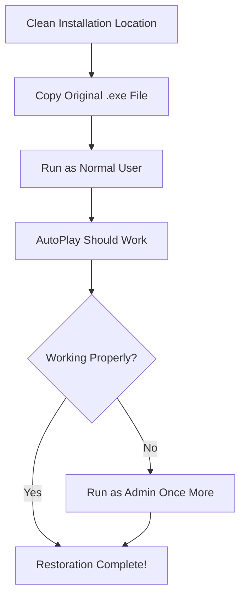

**Restoration Steps**:
1. **Clean up** your installation directory (delete any corrupted files)
2. **Copy** the original `Visual Basic 6 Portable.exe` back to the directory
3. **Run normally** (no admin rights needed since registry is intact)
4. **Test** by launching AutoPlay and then VB6 IDE

**You**: I followed those steps and everything is working again!

**Assistant**: Excellent! Since the registry setup was preserved, the restoration was quick and easy. For future reference, you might want to:

- **Backup** your VB6Portable folder periodically
- **Keep** the original .exe file in a safe location
- **Consider** version control for important project files

### System Change Reinstall

**You**: VB6 Portable stopped working after I made some system changes.

**Assistant**: System changes can sometimes affect VB6 Portable, especially if they involved registry cleanup, Windows updates, or security software changes.

**Let's diagnose what happened**:
- What type of system changes did you make? (Windows update, registry cleaning, antivirus changes, etc.)
- What symptoms are you seeing? (Won't start, permission errors, missing components?)
- When you try to run it, what exactly happens?

**You**: I ran a registry cleaner and now I get "license not found" errors.

**Assistant**: Ah, that's exactly what happened! Registry cleaners often remove VB6 license keys because they appear to be "orphaned" entries. This is a common issue.

**Solution Process**:
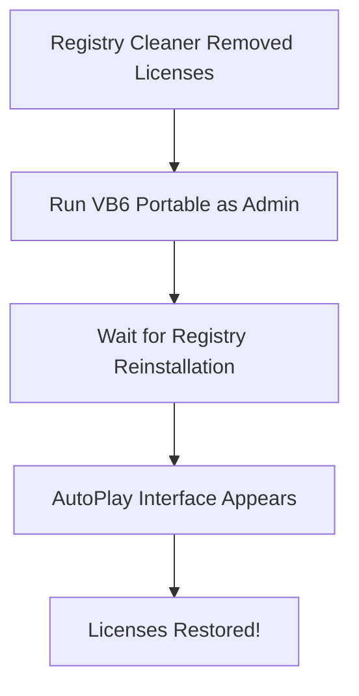

**Fix Steps**:
1. **Right-click** `Visual Basic 6 Portable.exe`
2. **Select** "Run as administrator"
3. **Wait** for the registry setup to complete (1-2 minutes)
4. **AutoPlay interface** should appear
5. **Test VB6 IDE** launch

This will reinstall the VB6 licenses that were removed by the registry cleaner.

**You**: That worked! It's running properly again.

**Assistant**: Great! For future reference, when using registry cleaners:

**Prevention Tips**:
- **Exclude VB6 keys**: Tell your registry cleaner to avoid VB6-related entries
- **Backup first**: Create a registry backup before cleaning
- **Test after**: Always test critical applications after system maintenance

**Common VB6 Registry Locations to Protect**:
- `HKEY_LOCAL_MACHINE\SOFTWARE\Microsoft\VisualBasic`
- `HKEY_LOCAL_MACHINE\SOFTWARE\Classes\VB.Application`
- License-related entries for Visual Basic 6.0

---

## New Computer Setup Chat

**You**: I'm setting up VB6 Portable on a new computer.

**Assistant**: Perfect! This is one of the best features of VB6 Portable - easy migration to new systems. The process is very similar to first-time setup, but I can give you some specific tips for new computer installations.

**Assistant**: How are you transferring VB6 Portable to the new computer?

**Transfer Methods**:
- "Copying from old computer over network" → [Network Transfer Setup](#network-transfer-setup)
- "Using a USB drive" → [USB Transfer Setup](#usb-transfer-setup)
- "Downloaded fresh copy" → [Fresh Download Setup](#fresh-download-setup)
- "Copied from backup" → [Backup Restore Setup](#backup-restore-setup)

### Network Transfer Setup

**You**: I'm copying the VB6Portable folder from my old computer over the network.

**Assistant**: Excellent choice! Network transfer preserves all your settings and project files. Here's the most efficient approach:

**Transfer Process**:
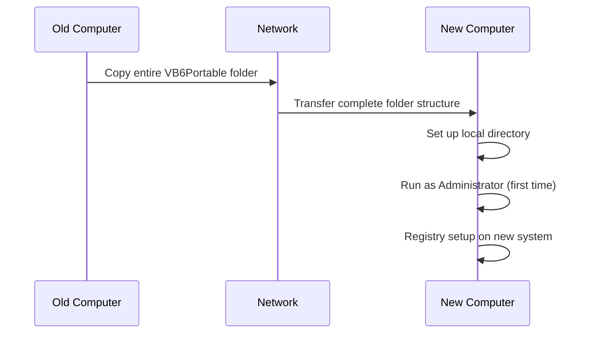

**What to Transfer**:
- ✅ **Entire VB6Portable folder** (not just the .exe)
- ✅ **All subfolders** (AutoPlay, extracted files, etc.)
- ✅ **Your project files** (if stored within the directory)
- ✅ **Any customizations** you've made

**You**: I've copied the entire folder to my new computer at `C:\Dev\VB6Portable`. What's next?

**Assistant**: Great! Now we need to set up the registry on your new computer. Even though you copied everything, each Windows system needs its own VB6 license registration.

**New Computer Setup Steps**:
1. **Navigate to** `C:\Dev\VB6Portable\`
2. **Right-click** `Visual Basic 6 Portable.exe`
3. **Select** "Run as administrator" 
4. **Wait for registry setup** (this will happen automatically)
5. **AutoPlay interface** should appear

**You**: I ran as administrator and the AutoPlay interface appeared after about a minute!

**Assistant**: Perfect! The registry setup for your new computer is complete. Let's test the VB6 IDE:

1. **Click "Start VB6"** in AutoPlay
2. **Wait for VB6 IDE** to load  
3. **Try opening** one of your existing projects

**You**: VB6 IDE opened and I can see my existing projects! Everything looks exactly like it did on my old computer.

**Assistant**: 🎉 **Success!** Your VB6 Portable installation is fully migrated to your new computer. All your projects, settings, and customizations have been preserved.

**New Computer Benefits**:
- ✅ **All projects intact**: No need to reconfigure anything
- ✅ **Same file paths**: Projects will find their files correctly  
- ✅ **Familiar environment**: Everything works exactly as before
- ✅ **Ready for development**: Start coding immediately

### USB Transfer Setup

**You**: I'm using a USB drive to transfer VB6 Portable to my new computer.

**Assistant**: USB transfer is perfect for VB6 Portable! In fact, you can run it directly from the USB drive or copy it to your new computer's hard drive.

**Your Options**:
- **Run directly from USB**: Keep it portable, run on any computer
- **Copy to hard drive**: Better performance, permanent installation

**You**: I want to copy it to the hard drive for better performance.

**Assistant**: Smart choice! Here's the USB-to-hard-drive setup process:

**Transfer Steps**:
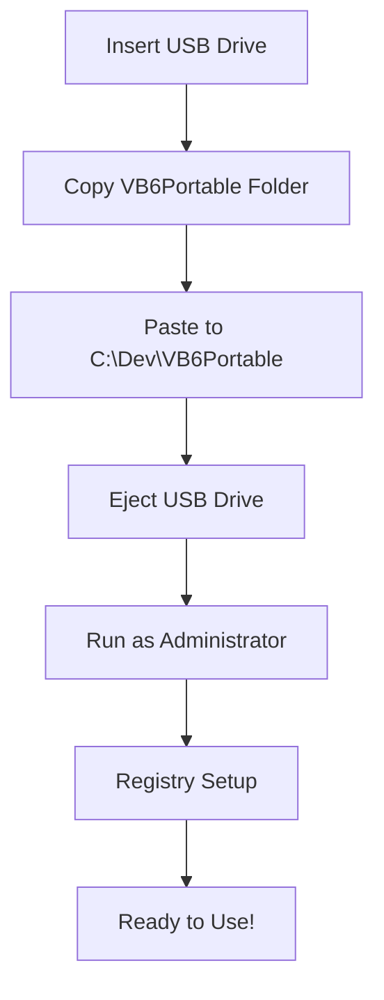

1. **Insert your USB drive**
2. **Copy the entire VB6Portable folder** (not just the .exe)
3. **Paste to your desired location** (e.g., `C:\Dev\VB6Portable`)
4. **Safely eject the USB drive**
5. **Right-click the .exe** → "Run as administrator"
6. **Wait for AutoPlay interface**

**You**: I've completed the copy and run as administrator. The AutoPlay interface is showing!

**Assistant**: Excellent! Your USB transfer is successful. The registry is now set up for your new computer, and you have the performance benefits of running from the hard drive.

**Performance Benefits You'll Notice**:
- ⚡ **Faster startup**: No USB access delays  
- 📁 **Quicker file access**: Hard drive is faster than USB
- 🔧 **Better compilation**: Faster build times
- 💾 **Reliable saving**: No risk of USB disconnection during work

---

## USB Portable Setup Chat

**You**: I want to set up VB6 Portable on a USB drive so I can use it on multiple computers.

**Assistant**: Excellent choice! This is exactly what VB6 Portable was designed for. USB portable setup gives you the ultimate flexibility to develop VB6 applications anywhere.

**Assistant**: What size USB drive are you planning to use, and what computers do you expect to use it on?

**USB Drive Requirements**:
- **Minimum size**: 200MB (just for VB6 Portable)
- **Recommended size**: 2GB+ (room for projects and files)  
- **Optimal size**: 8GB+ (plenty of space for large projects)
- **USB version**: USB 2.0 or higher for good performance

**You**: I have a 16GB USB 3.0 drive, and I plan to use it on various Windows computers at work and home.

**Assistant**: Perfect setup! 16GB USB 3.0 is ideal - plenty of space and fast performance. Let's create the ultimate portable VB6 development setup:

### USB Setup Process

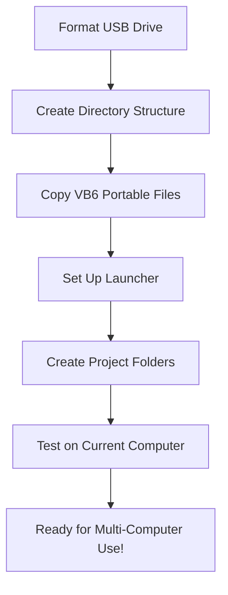

**Step 1: Prepare USB Drive**

**Assistant**: First, let's prepare your USB drive with an optimal structure:

1. **Insert your 16GB USB drive**
2. **Format if needed** (FAT32 for maximum compatibility, or NTFS for modern Windows systems)
3. **Create this folder structure**:
   ```
   [USB Drive]\
   ├── VB6Portable\
   ├── Projects\
   ├── Backup\
   └── Tools\
   ```

**You**: I've formatted it as NTFS and created those folders.

**Assistant**: Great choice! NTFS will give you better performance and support for larger project files.

**Step 2: Install VB6 Portable**

**Copy Process**:
1. **Copy** `Visual Basic 6 Portable.exe` to `[USB]\VB6Portable\`
2. **Navigate** to `[USB]\VB6Portable\` 
3. **Right-click** the .exe → "Run as administrator"
4. **Wait** for first-time setup and AutoPlay interface

**You**: I've copied the file and run as administrator. The AutoPlay interface appeared and VB6 Portable extracted files to the USB drive.

**Assistant**: Excellent! Your USB installation is active. Now let's set up the portable project workflow:

**Step 3: Project Organization**

**Recommended USB Structure**:
```
[USB Drive]\
├── VB6Portable\
│   ├── Visual Basic 6 Portable.exe
│   └── Visual Basic 6 Portable\ (extracted files)
├── Projects\
│   ├── Personal\
│   ├── Work\
│   └── Learning\
├── Backup\
│   └── (automatic project backups)
└── Tools\
    └── (additional utilities)
```

**You**: That structure makes sense. How do I use this on different computers?

### Multi-Computer Usage

**Assistant**: Here's the workflow for using your USB VB6 setup on different computers:

**On Each New Computer**:
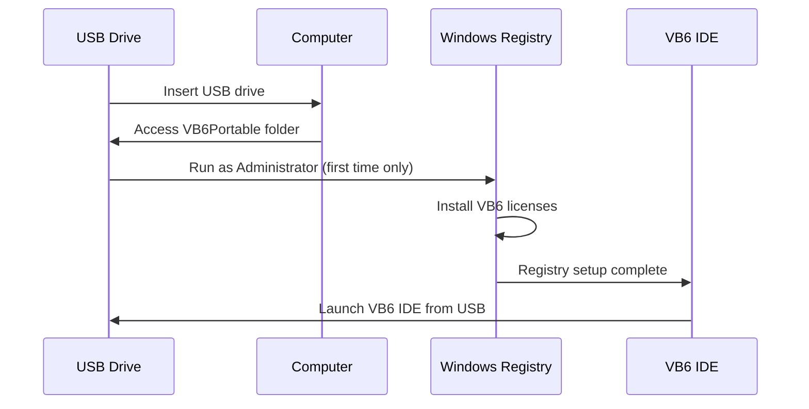

**First Use on Each Computer**:
1. **Insert USB drive**
2. **Navigate to** `[USB]\VB6Portable\`
3. **Right-click** `Visual Basic 6 Portable.exe` → "Run as administrator"
4. **Wait for registry setup** (1-2 minutes)
5. **AutoPlay interface** appears - setup complete!

**Subsequent Uses on Same Computer**:
1. **Insert USB drive**  
2. **Double-click** `Visual Basic 6 Portable.exe` (no admin needed)
3. **AutoPlay immediately** - registry already configured
4. **Start developing!**

**You**: This is perfect! I can take my entire development environment anywhere. What about saving projects?

**Assistant**: Great question! Project management is crucial for USB portable setups:

**Project Workflow**:

**When Creating New Projects**:
1. **Create project in** `[USB]\Projects\[Category]\`
2. **Always use relative paths** when possible
3. **Keep all resources** within project folder
4. **Regular saves** to USB drive

**Project Portability Tips**:
- ✅ **Avoid absolute paths**: Use relative references to files
- ✅ **Include all resources**: Graphics, sounds, data files in project folder
- ✅ **Self-contained projects**: Don't rely on computer-specific files
- ✅ **Regular backups**: Copy important projects to `Backup\` folder

**Example Project Structure**:
```
[USB]\Projects\Work\DatabaseApp\
├── DatabaseApp.vbp (project file)
├── Forms\
│   ├── MainForm.frm
│   └── DataForm.frm  
├── Modules\
│   └── DataModule.bas
├── Resources\
│   ├── Icons\
│   └── Images\
└── Data\
    └── TestData.mdb
```

**You**: This gives me a completely portable development environment! Any other tips?

**Assistant**: Yes! Here are some pro tips for USB VB6 portable development:

**Performance Optimization**:
- 🚀 **Use USB 3.0 ports** when available for faster access
- 💾 **Close unnecessary programs** when developing to free up RAM
- 📁 **Keep projects reasonably sized** to avoid long load times

**Multi-Computer Best Practices**:
- 🔄 **Test on different systems** to ensure compatibility
- 🛡️ **Backup regularly** to cloud storage or another drive
- 📋 **Document system requirements** if your projects need specific components
- ⚙️ **Use standard Windows fonts** to avoid missing font issues

**Security Considerations**:
- 🔒 **Encrypt sensitive projects** if working with confidential code  
- 👥 **Don't leave USB unattended** in shared environments
- 🗑️ **Secure delete** when disposing of old project versions

**Professional Workflow**:
- 📝 **Version control**: Consider portable Git for project versioning
- 🔧 **Testing**: Test compiled programs on multiple computers
- 📚 **Documentation**: Keep project docs in the USB structure

**You**: This is incredibly comprehensive! I now have everything I need for professional portable VB6 development.

**Assistant**: 🎉 **Perfect!** You now have a complete, professional-grade portable VB6 development environment that you can use anywhere. Your 16GB USB 3.0 setup will serve you well for:

- ✅ **Multi-location development** (home, work, clients)
- ✅ **Collaboration** (share entire environment with colleagues)  
- ✅ **Learning** (practice VB6 anywhere with consistent environment)
- ✅ **Professional projects** (complete toolset always available)

**Quick Reference for Daily Use**:
1. **Insert USB** on any Windows computer
2. **Run as admin** (first time on each computer only)  
3. **Double-click to launch** (subsequent uses)
4. **Save projects** in organized USB folder structure
5. **Take anywhere** and continue development seamlessly

Happy portable VB6 development! 🚀💼

---

## Advanced Installation Scenarios

### Network Installation Chat

**You**: I want to set up VB6 Portable on a network share for multiple users.

**Assistant**: Network installation is a great way to provide VB6 development access to multiple users! However, there are some important considerations for shared network setups.

**Network Architecture Options**:
- **Shared Read-Only**: Master installation, users run from network
- **Individual Copies**: Users copy to local machines  
- **Terminal Server**: Single server, multiple remote users
- **Virtual Desktop**: VDI environment with shared resources

**You**: I want users to be able to run it directly from the network share.

**Assistant**: That's possible, but requires careful planning. Here's the optimal network setup:

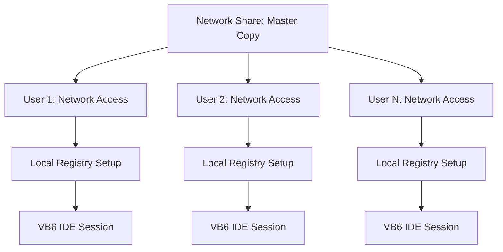

**Network Setup Process**:

1. **Create network share** (e.g., `\\server\VB6Portable`)
2. **Set permissions**: Read/Execute for all users
3. **Copy VB6 Portable** to the share
4. **Create user instructions** for registry setup

**Important Limitations**:
- ⚠️ **Each user** needs local admin rights for first-time setup
- ⚠️ **Registry per machine**: Each computer needs individual license setup
- ⚠️ **Performance**: Network access slower than local installation
- ⚠️ **Concurrent access**: VB6 may have issues with simultaneous network access

**You**: That seems complex. What would you recommend instead?

**Assistant**: For network environments, I'd recommend the **Individual Copy** approach:

**Better Network Strategy**:
1. **Master copy** on network share (for distribution)
2. **Users copy** to their local `C:\Dev\VB6Portable\`  
3. **Standardized setup** instructions for all users
4. **Shared project directories** for collaboration

**Benefits of Individual Copies**:
- ✅ **Better performance**: Local execution is faster
- ✅ **Simpler setup**: Each user owns their installation  
- ✅ **Fewer conflicts**: No concurrent access issues
- ✅ **Easier troubleshooting**: Isolated user environments

**Implementation**:
```batch
:: User setup script (run as administrator)
@echo off
echo Setting up VB6 Portable for %USERNAME%
xcopy "\\server\VB6Portable\*" "C:\Dev\VB6Portable\" /E /I
cd /d "C:\Dev\VB6Portable"
"Visual Basic 6 Portable.exe"
echo Setup complete for %USERNAME%
```

### Enterprise Installation Chat

**You**: We need to deploy VB6 Portable across our enterprise with 100+ developers.

**Assistant**: Enterprise deployment requires a systematic approach! Let's design a scalable solution for your developer team.

**Enterprise Requirements Assessment**:
- How many developers need access?
- What's your IT security policy on admin rights?
- Do you have deployment tools (SCCM, Group Policy, etc.)?  
- Are developers on standardized Windows images?

**You**: We have 150 developers, limited admin rights, SCCM available, and standardized Windows 10/11 images.

**Assistant**: Perfect! With SCCM and standardized images, we can create an enterprise-grade deployment:

**Enterprise Deployment Strategy**:

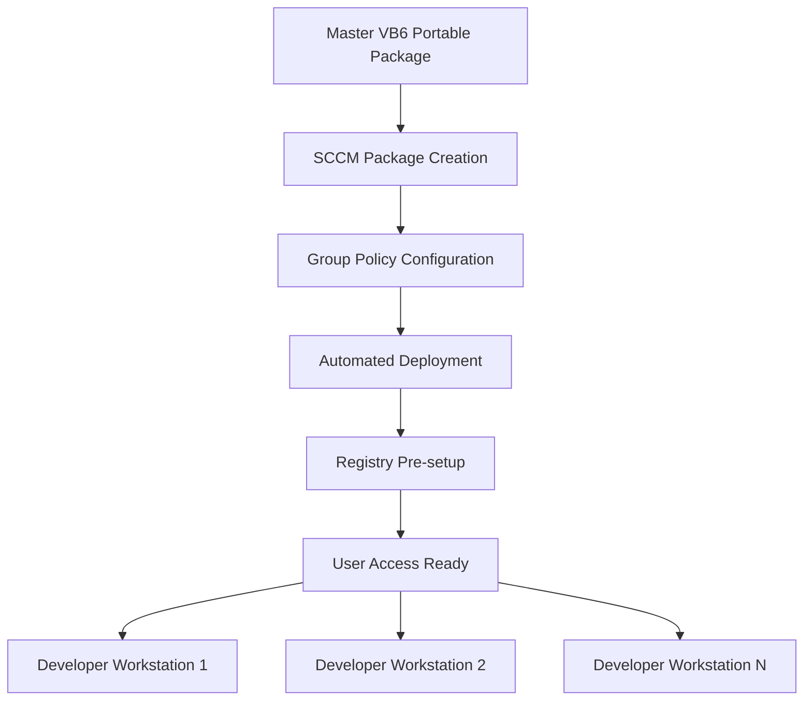

**Phase 1: Package Preparation**
1. **Create master package** with VB6 Portable
2. **Build deployment script** with registry pre-configuration
3. **Test on pilot group** (5-10 developers)
4. **Document troubleshooting** procedures

**Phase 2: SCCM Deployment**
1. **Create SCCM application**
2. **Set deployment requirements** (Windows 10/11, disk space, etc.)
3. **Configure installation command**:
   ```batch
   xcopy "%~dp0*" "%ProgramData%\VB6Portable\" /E /I /Y
   reg import "%ProgramData%\VB6Portable\VB6Licenses.reg"
   ```
4. **Deploy to device collections**

**Phase 3: User Access**
1. **Desktop shortcuts** via Group Policy
2. **Start Menu entries** for easy access
3. **User documentation** and training
4. **Help desk procedures**

**You**: This looks comprehensive. What about licensing compliance at enterprise scale?

**Assistant**: Excellent question! Enterprise licensing is crucial:

**Licensing Compliance Strategy**:
- 📋 **Audit existing licenses**: Count your VB6 licenses
- 📊 **Match to deployments**: Ensure sufficient license coverage
- 📝 **Document usage**: Track which developers are using VB6
- 🔍 **Regular reviews**: Periodic license compliance checks

**Common Enterprise License Scenarios**:
- **Volume Licensing**: Most enterprises have VB6 through volume programs
- **MSDN Subscriptions**: Individual developer licenses  
- **Legacy Licenses**: Older VB6 Professional/Enterprise editions
- **Educational**: Academic licensing for training environments

**Compliance Tools**:
1. **License inventory** spreadsheet or database
2. **Usage tracking** via SCCM reporting
3. **Regular audits** of active installations
4. **Documentation** of license assignments

**You**: Perfect! This gives us a complete enterprise deployment strategy.

**Assistant**: 🎉 **Excellent!** You now have a professional enterprise deployment plan for VB6 Portable IDE that addresses:

✅ **Scalability**: 150+ developers supported  
✅ **Security**: Limited admin rights respected  
✅ **Automation**: SCCM deployment reduces manual effort  
✅ **Compliance**: Licensing requirements addressed  
✅ **Standardization**: Consistent environment across all developers  
✅ **Support**: Documentation and troubleshooting procedures  

**Implementation Timeline Suggestion**:
- **Week 1-2**: Package preparation and pilot testing
- **Week 3**: SCCM package creation and testing  
- **Week 4**: Phased deployment (25 developers per day)
- **Week 5**: Full deployment completion and support

Your enterprise VB6 development environment will be robust, compliant, and professionally managed! 🏢🚀

---

*This interactive installation guide provides conversational support for all VB6 Portable IDE setup scenarios. For additional technical details, see our [complete installation documentation](installation.md).*