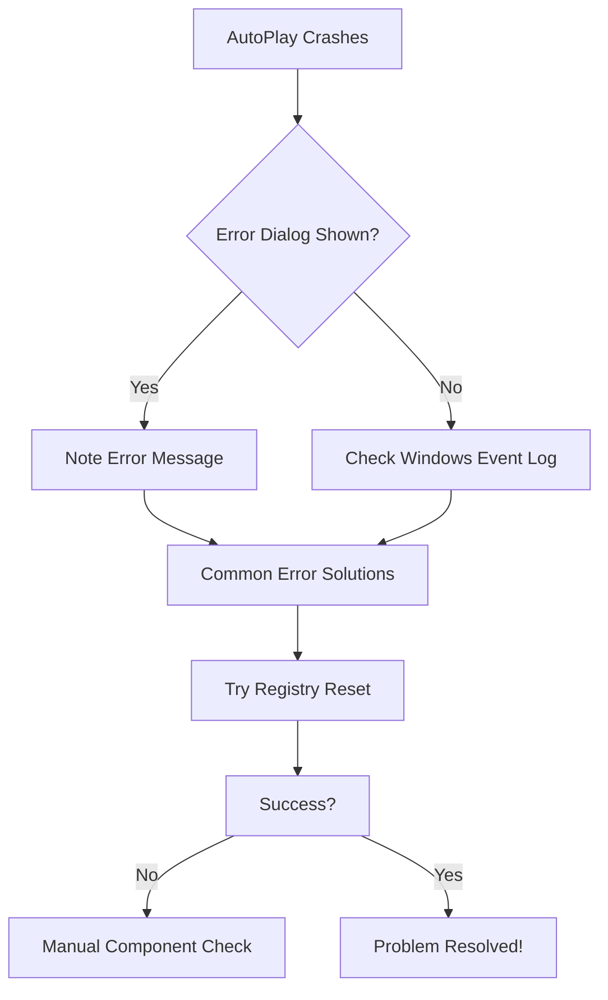
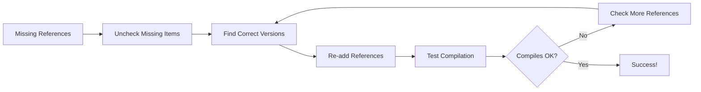
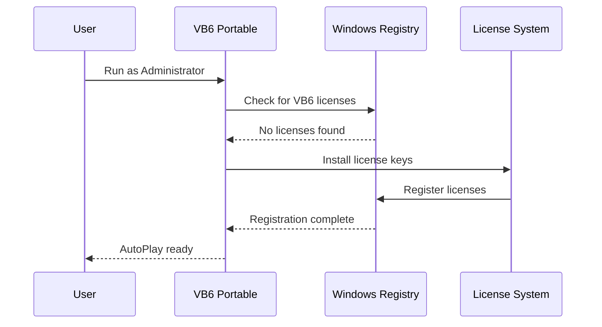

# Interactive Chat Troubleshooting Guide

Welcome to the VB6 Portable IDE Interactive Troubleshooting Assistant! This conversational guide will help you resolve issues quickly and efficiently.

## 🤖 Chat-Based Problem Resolution

### Quick Start Chat
**Assistant**: Hello! I'm here to help you troubleshoot VB6 Portable IDE issues. What seems to be the problem today?

**Common User Responses**:
- "VB6 won't start" → [Startup Issues Chat](#startup-issues-chat)
- "Permission denied error" → [Permission Issues Chat](#permission-issues-chat)  
- "IDE is running slowly" → [Performance Issues Chat](#performance-issues-chat)
- "Can't compile my project" → [Compilation Issues Chat](#compilation-issues-chat)
- "Registry errors appearing" → [Registry Issues Chat](#registry-issues-chat)

---

## Startup Issues Chat

**Assistant**: I see you're having trouble starting VB6 Portable IDE. Let's work through this step by step.

**Assistant**: First, can you tell me what happens when you try to run `Visual Basic 6 Portable.exe`?

### Response Path A: "Nothing happens"
**You**: Nothing happens when I double-click the executable.

**Assistant**: Let's check the basics:
1. **File Integrity Check**: Right-click the file → Properties. Is the size approximately 6MB?
2. **Administrator Rights**: Try right-clicking → "Run as Administrator"
3. **Antivirus Interference**: Check if your antivirus is blocking the file

**If size is wrong** → [File Corruption Chat](#file-corruption-chat)
**If admin rights needed** → [Permission Issues Chat](#permission-issues-chat)
**If antivirus blocking** → [Antivirus Issues Chat](#antivirus-issues-chat)

### Response Path B: "Error message appears"
**You**: I get an error message when trying to start.

**Assistant**: What does the error message say exactly? Here are the most common ones:

**"Access denied" or "Permission denied"**
- → This is a [permission issue](#permission-issues-chat). Try running as Administrator.

**"File not found" or "Missing component"**
- → This might be a [dependency issue](#dependency-issues-chat).

**"Registry error"**
- → This is a [registry configuration issue](#registry-issues-chat).

### Response Path C: "It starts but crashes"
**You**: The program starts but then crashes or closes immediately.

**Assistant**: This suggests the AutoPlay system is having trouble. Let's diagnose:

**Next Step**: Can you see any error dialogs, or should we check the Windows Event Log?

---

## Permission Issues Chat

**Assistant**: Permission issues are common with VB6 Portable IDE because it needs to set up registry entries on first run.

**Assistant**: Are you seeing one of these messages?
- "Access is denied"
- "You need administrator permission"
- "Registry access denied"
- "Unable to write to HKEY_LOCAL_MACHINE"

### Solution Conversation

**You**: Yes, I'm getting "Access is denied"

**Assistant**: Perfect! This is exactly what we need to fix. Here's what's happening:

1. **Why this happens**: VB6 Portable needs to register licenses and components in Windows Registry
2. **First-time setup**: This only happens on the very first launch
3. **After setup**: Subsequent launches won't need admin rights

**Step-by-step solution**:
1. Right-click on `Visual Basic 6 Portable.exe`
2. Select "Run as administrator"  
3. Click "Yes" when Windows asks for permission
4. Wait for the AutoPlay interface to appear (may take 1-2 minutes)

**Assistant**: Try those steps and let me know what happens. Does the AutoPlay interface appear?

**You**: Yes! The AutoPlay interface is now showing.

**Assistant**: Excellent! The registry setup is complete. From now on, you can run VB6 Portable normally (without administrator rights). 

**Next**: Click "Start VB6" in the AutoPlay interface to launch the development environment.

---

## Performance Issues Chat

**Assistant**: I'll help you optimize VB6 Portable IDE performance. Let's identify the specific performance issue you're experiencing.

**Assistant**: What type of performance problem are you having?

### Slow Startup Conversation
**You**: The program takes forever to start.

**Assistant**: Let's measure and optimize startup time:

```mermaid
gantt
    title Expected vs Actual Startup Times
    dateFormat X
    axisFormat %s
    
    section Expected Times
    Launch Executable    :done, expected1, 0, 1s
    Registry Check      :done, expected2, after expected1, 2s  
    AutoPlay Loading    :done, expected3, after expected2, 1s
    VB6 IDE Launch     :done, expected4, after expected3, 5s
    
    section Your Experience
    Tell me your times  :active, actual, 0, 15s
```

**Assistant**: Time how long each step takes:
1. **Double-click to first sign of activity** (should be ~1 second)
2. **First sign of activity to AutoPlay menu** (should be ~3 seconds)  
3. **AutoPlay menu to VB6 IDE ready** (should be ~5 seconds)

Which step is taking too long?

### Slow IDE Operation Conversation  
**You**: The VB6 IDE itself is slow and laggy.

**Assistant**: IDE performance can be affected by several factors:

**Memory Check**:
- Open Task Manager while VB6 is running
- Look for "VB6.EXE" in Processes tab
- How much memory (MB) is it using?

**Common Memory Usage**:
- **Normal**: 50-150MB
- **High but OK**: 150-300MB  
- **Too High**: 300MB+

**If memory usage is high**: You might have a large project or memory leak
**If memory usage is normal**: The issue might be system-related

**Assistant**: What's the memory usage showing? And are you working with a particularly large VB6 project?

---

## Compilation Issues Chat

**Assistant**: Compilation problems can be frustrating! Let's get your VB6 projects building successfully.

**Assistant**: What happens when you try to compile? Do you:
- Get error messages?
- Have missing references?
- Experience crashes during compilation?

### Missing References Conversation
**You**: I get "User-defined type not defined" or "Sub or Function not defined" errors.

**Assistant**: These are classic reference issues. Let's check your project references:

**Step 1**: In VB6 IDE, go to Project → References
**Step 2**: Look for any references marked with "MISSING" 

**Assistant**: Do you see any items marked as "MISSING" in the References dialog?

**You**: Yes, I see some missing references.

**Assistant**: Great! Here's how to fix this:

1. **Uncheck** all items marked as "MISSING"
2. **Browse** for the correct versions of these libraries
3. **Re-add** them to your project
4. **Try compiling** again

**Common VB6 References Location**:
- Most are in `C:\Windows\System32\`
- Some may be in your VB6 Portable directory

**Assistant**: Try these steps and let me know if you still see missing references.

---

## Registry Issues Chat

**Assistant**: Registry issues with VB6 Portable usually relate to licensing or component registration. I'll help you resolve them.

**Assistant**: What type of registry error are you seeing?
- "License not found"
- "Component not properly registered"  
- "Registry access denied"
- "Invalid license key"

### License Issues Conversation
**You**: I'm getting "License not found" or license-related errors.

**Assistant**: This means the VB6 licenses weren't properly registered during initial setup. Let's fix this:

**Solution Process**:
1. **Close VB6 completely** (including any background processes)
2. **Delete Wine config** (if using Wine/Linux): `rm -rf ~/.wine`
3. **Run as Administrator** again: Right-click → "Run as administrator"  
4. **Wait for complete setup** (may take 3-5 minutes)

**Assistant**: Try the complete re-setup process and let me know if you still get license errors.

---

## Advanced Troubleshooting Chat

### System Compatibility Conversation
**Assistant**: If basic troubleshooting hasn't resolved your issue, let's check system compatibility:

**Your System Info Needed**:
- Windows version (7, 8, 10, 11)?
- 32-bit or 64-bit?
- Available RAM?
- Antivirus software?

**You**: Windows 11, 64-bit, 16GB RAM, Windows Defender

**Assistant**: Good configuration! Windows 11 64-bit with 16GB RAM should run VB6 Portable perfectly.

**Windows 11 Specific Considerations**:
- ✅ **Compatibility**: VB6 Portable runs well on Windows 11
- ✅ **Memory**: 16GB is more than sufficient  
- ✅ **Windows Defender**: Usually compatible

**Potential Windows 11 Issues**:
1. **SmartScreen filter**: May block on first run
2. **Enhanced security**: Might require explicit permission
3. **Compatibility mode**: Rarely needed but available

**Assistant**: Have you seen any Windows SmartScreen warnings when running the executable?

---

## Getting More Help

### If Chat Troubleshooting Doesn't Resolve Your Issue

**Assistant**: I've walked you through the most common solutions. If you're still experiencing problems, here are your next steps:

**Escalation Path**:
1. **Detailed Documentation**: Check our [comprehensive troubleshooting guide](troubleshooting.md)
2. **System Diagnostics**: Run our [diagnostic flowcharts](troubleshooting.md#diagnostic-procedures)
3. **Community Support**: Search existing issues on GitHub
4. **Expert Help**: Create a detailed issue report

**When Creating an Issue Report, Include**:
- Your exact Windows version
- Complete error message text  
- Steps that led to the problem
- Whether you've tried the chat solutions above

**Assistant**: You've been through a systematic troubleshooting process. Most users find their solutions in this chat guide, but don't hesitate to seek additional help if needed!

---

## Success Stories

### Resolved Issues Examples

**"Startup Permission Problem"**:
> **User**: "VB6 Portable wouldn't start, kept getting access denied"  
> **Solution**: Ran as Administrator once, then worked normally  
> **Result**: ✅ Working perfectly now!

**"Missing References Error"**:  
> **User**: "Project wouldn't compile, lots of 'not defined' errors"
> **Solution**: Unchecked missing references and re-added correct versions
> **Result**: ✅ Project compiles successfully!

**"Slow Performance"**:
> **User**: "IDE was very laggy and slow"  
> **Solution**: Closed other applications, freed up 4GB RAM
> **Result**: ✅ VB6 IDE now runs smoothly!

**Assistant**: Your issue is likely similar to one of these common scenarios. The chat troubleshooting above should get you back to productive VB6 development quickly!

---

*This interactive troubleshooting guide provides step-by-step conversational support for common VB6 Portable IDE issues. For additional technical details, see our [complete troubleshooting documentation](troubleshooting.md).*