# Diagrams Index

This document provides an index of all Mermaid and PlantUML diagrams included in the VB6 Portable IDE documentation.

## Mermaid Diagrams

### Architecture Diagrams

**System Overview** ([architecture.md](architecture.md))
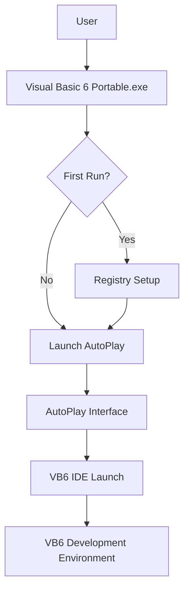

**Data Flow** ([architecture.md](architecture.md))
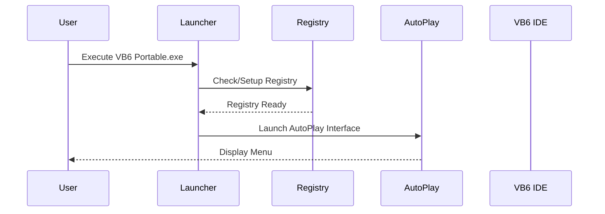

**System Layers** ([architecture.md](architecture.md))
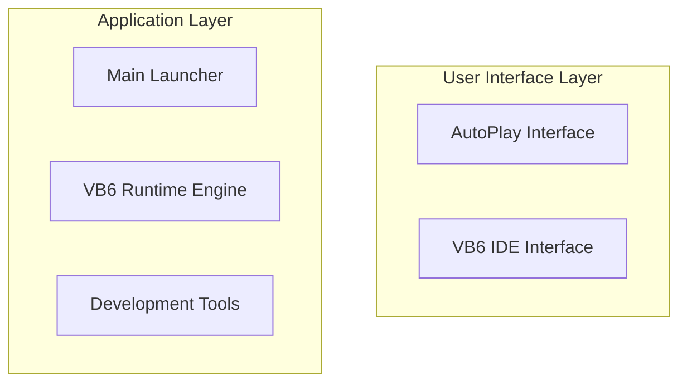

### Installation Diagrams

**Installation Process** ([installation.md](installation.md))
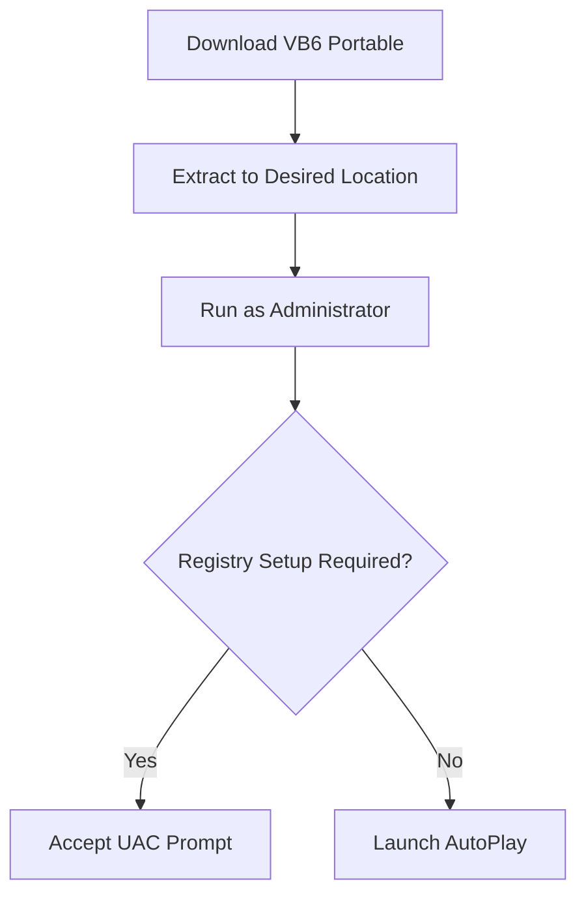

**Configuration States** ([installation.md](installation.md))
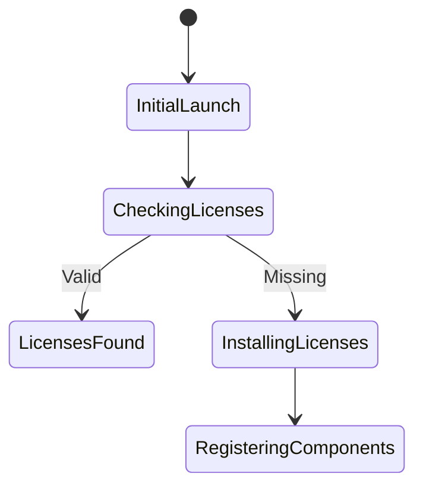

### User Guide Diagrams

**Development Workflow** ([user-guide.md](user-guide.md))
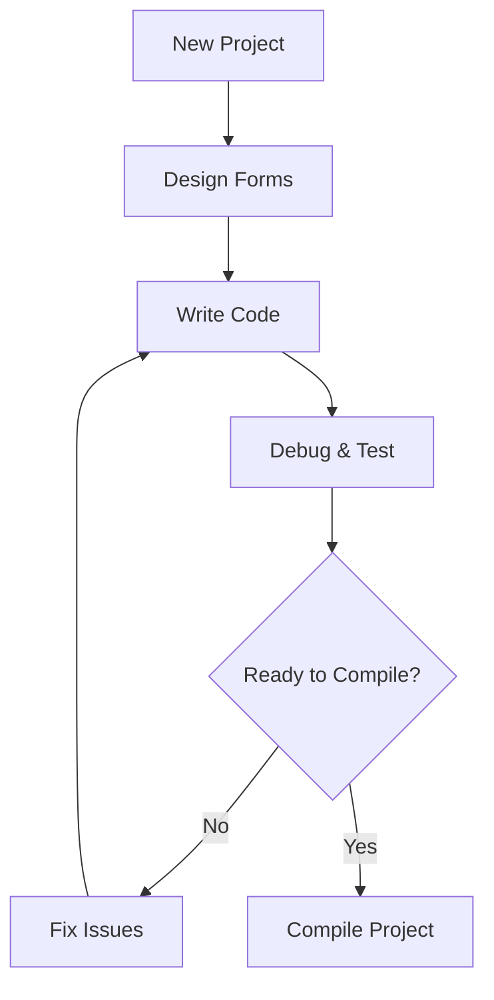

**Compilation Options** ([user-guide.md](user-guide.md))
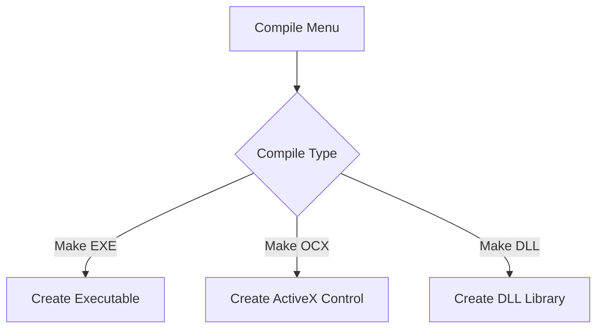

### Technical Reference Diagrams

**File Types Structure** ([technical-reference.md](technical-reference.md))
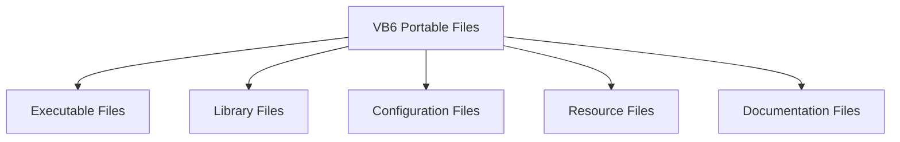

**Memory Architecture** ([technical-reference.md](technical-reference.md))
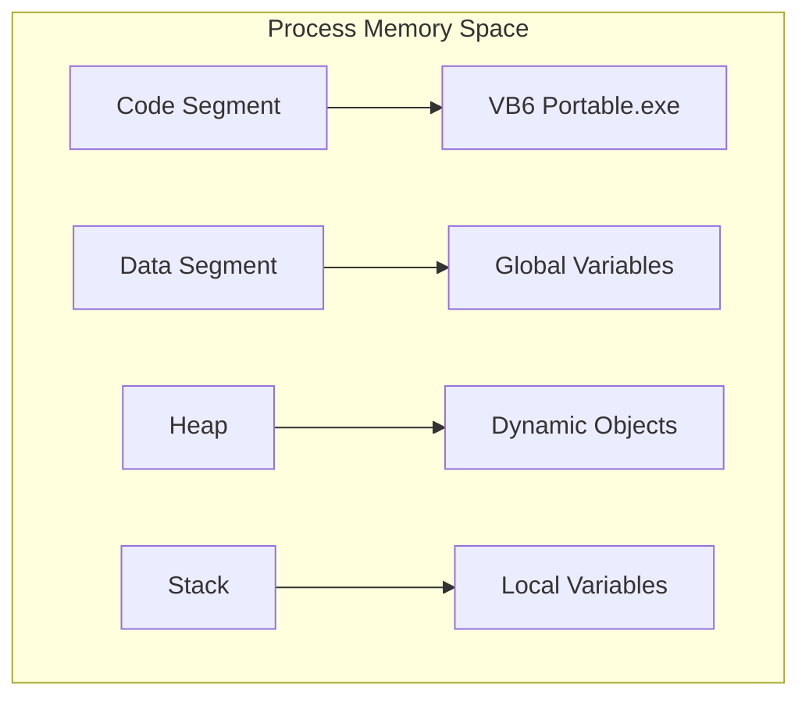

### Troubleshooting Diagrams

**Startup Issues** ([troubleshooting.md](troubleshooting.md))
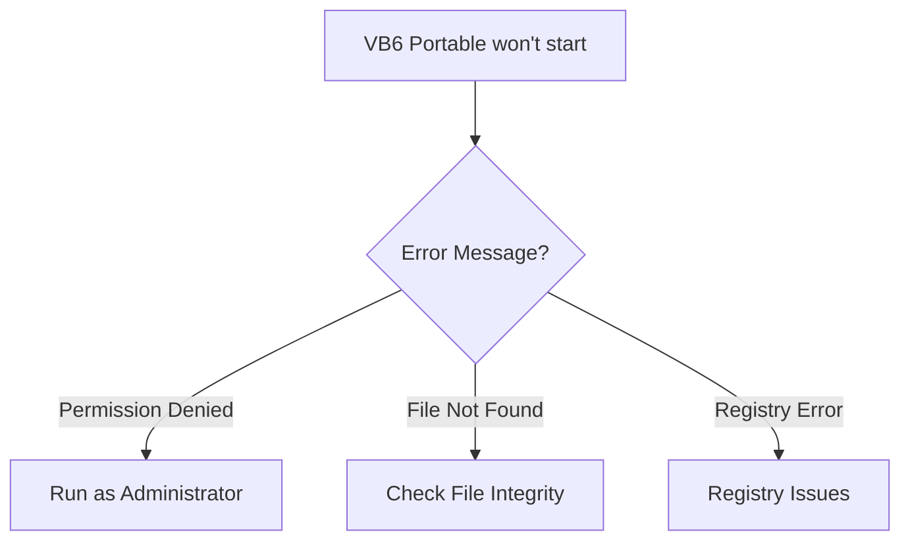

**Performance Diagnosis** ([troubleshooting.md](troubleshooting.md))
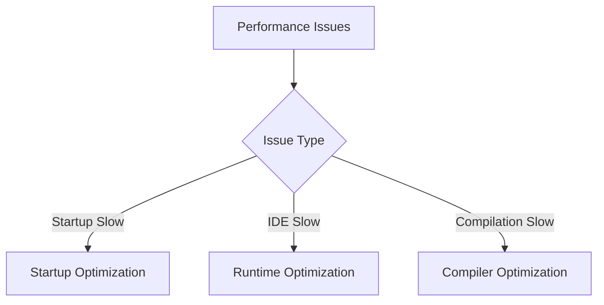

## PlantUML Diagrams

### Component Diagrams

**System Components** ([architecture.md](architecture.md))
```plantuml
@startuml
package "VB6 Portable IDE System" {
    RECTANGLE "Main Launcher" as launcher {
        +execute()
        +checkFirstRun()
        +initializeRegistry()
    }
    
    RECTANGLE "AutoPlay Engine" as autoplay {
        +loadInterface()
        +handleUserInput()
        +launchVB6()
    }
}
@enduml
```

**Component Dependencies** ([technical-reference.md](technical-reference.md))
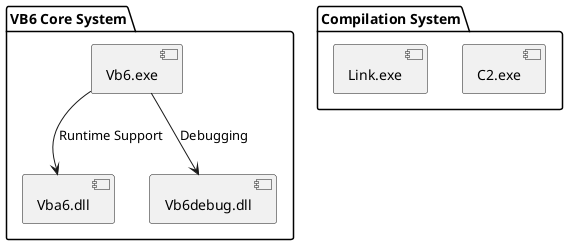

### Sequence Diagrams

**Installation Sequence** ([installation.md](installation.md))
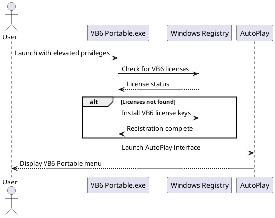

**Development Sequence** ([user-guide.md](user-guide.md))
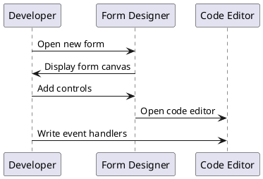

### Use Case Diagrams

**System Usage** ([architecture.md](architecture.md))
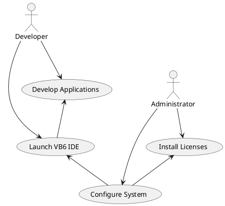

### Deployment Diagrams

**Network Deployment** ([technical-reference.md](technical-reference.md))
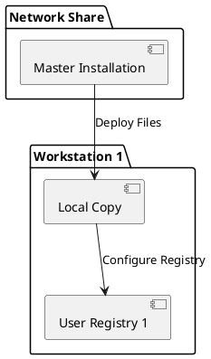

**Security Model** ([architecture.md](architecture.md))
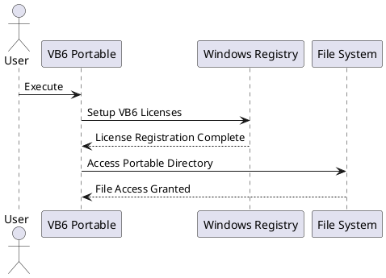

### Class Diagrams

**API Reference** ([technical-reference.md](technical-reference.md))
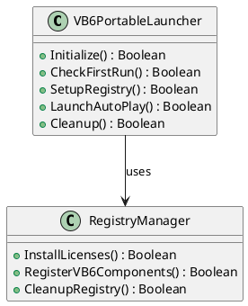

**Plugin Architecture** ([technical-reference.md](technical-reference.md))
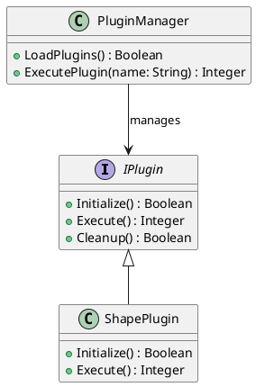

## Diagram Usage Guidelines

### For Documentation Writers

1. **Consistency**: Use similar styling and naming conventions across diagrams
2. **Clarity**: Keep diagrams focused on specific aspects of the system
3. **Maintenance**: Update diagrams when system architecture changes
4. **Integration**: Reference diagrams from appropriate documentation sections

### For Developers

1. **Understanding System Flow**: Use sequence diagrams to understand process interactions
2. **Architecture Comprehension**: Reference component diagrams for system structure
3. **Troubleshooting**: Use flowchart diagrams to debug issues systematically
4. **Planning Changes**: Use existing diagrams as templates for documenting modifications

### For System Administrators

1. **Deployment Planning**: Reference deployment diagrams for installation procedures
2. **Issue Resolution**: Use troubleshooting flowcharts for systematic problem-solving
3. **Security Understanding**: Reference security diagrams for permission requirements
4. **Performance Analysis**: Use performance diagrams to identify bottlenecks

## Rendering the Diagrams

### Mermaid Diagrams
- Can be rendered in GitHub, GitLab, and most modern markdown viewers
- Use online editors like mermaid.live for testing
- Integrate with documentation platforms that support Mermaid

### PlantUML Diagrams
- Require PlantUML processor for rendering
- Use online editors like plantuml.com for quick viewing
- Can be integrated into CI/CD pipelines for automatic generation
- Support export to PNG, SVG, and other formats

### Tools and Integration

**Online Tools**:
- [Mermaid Live Editor](https://mermaid.live)
- [PlantUML Online Server](http://www.plantuml.com/plantuml/)
- [Draw.io](https://draw.io) (supports both formats)

**IDE Integration**:
- VS Code extensions for both Mermaid and PlantUML
- IntelliJ/WebStorm plugins available
- Atom and Sublime Text extensions

**Documentation Platforms**:
- GitHub/GitLab native Mermaid support
- GitBook, Notion, and other platforms
- Static site generators (Jekyll, Hugo, etc.)

This comprehensive diagram index helps navigate the visual documentation and ensures consistency across all technical diagrams in the VB6 Portable IDE documentation suite.