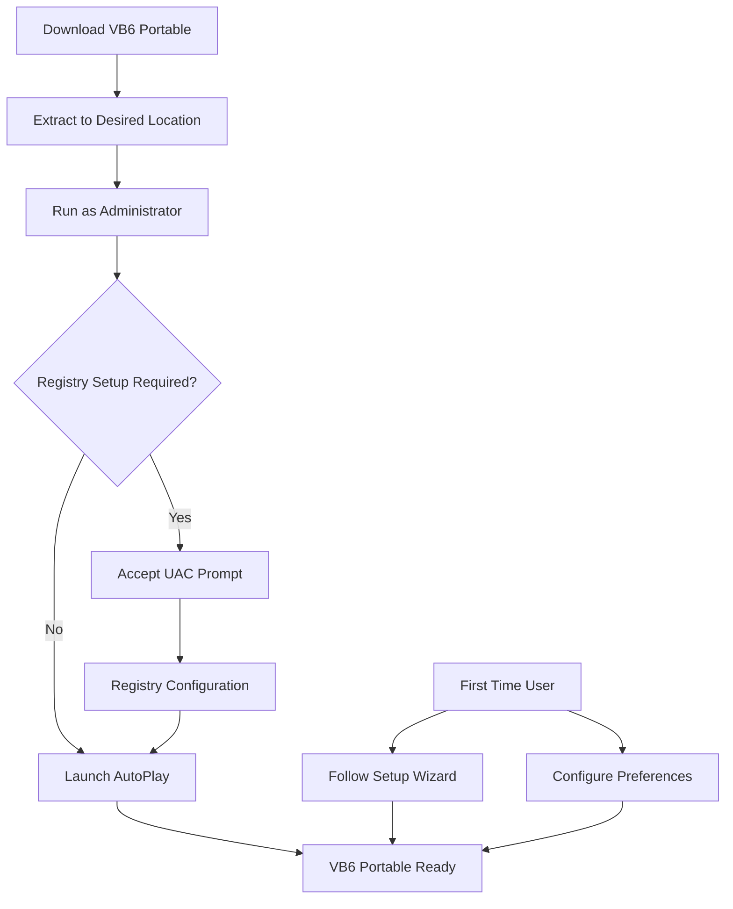
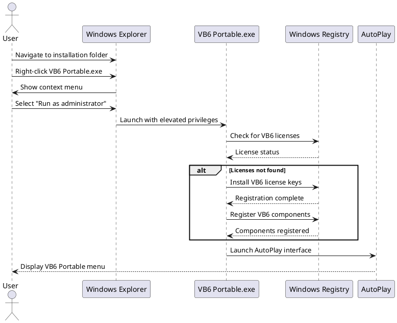
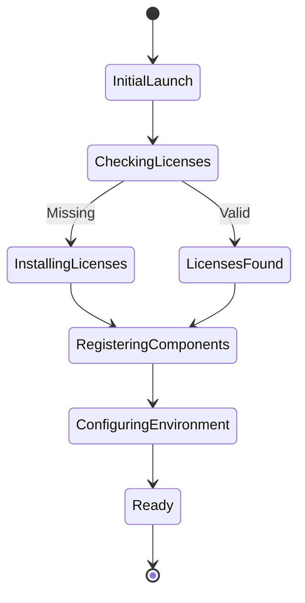
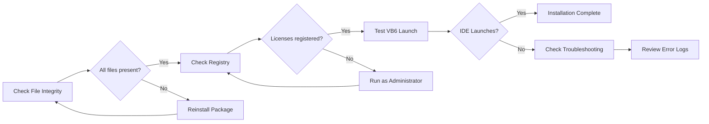
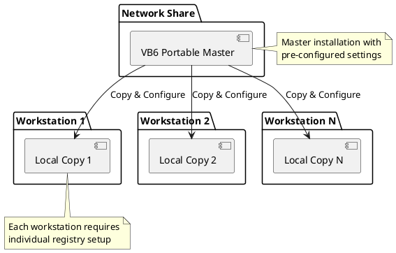
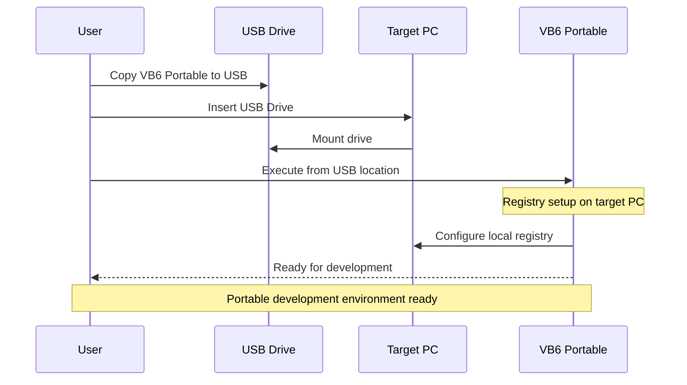
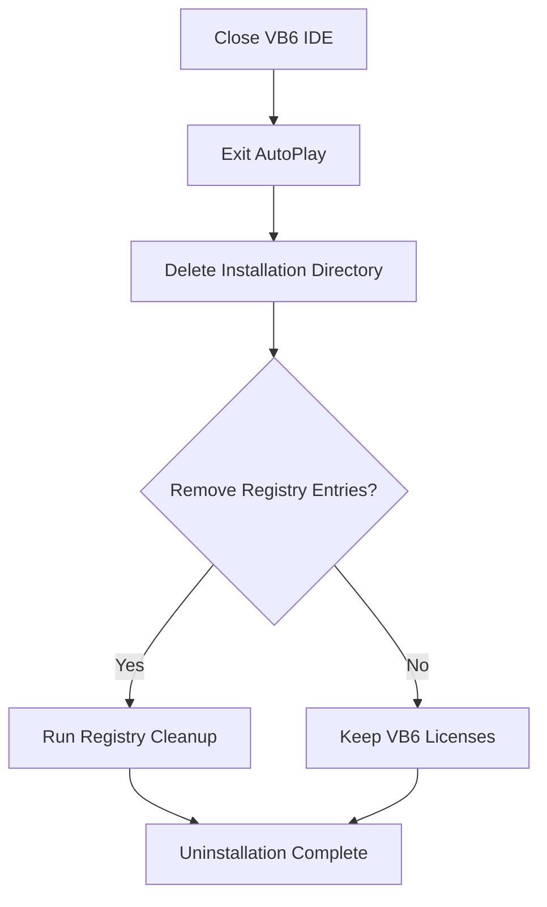
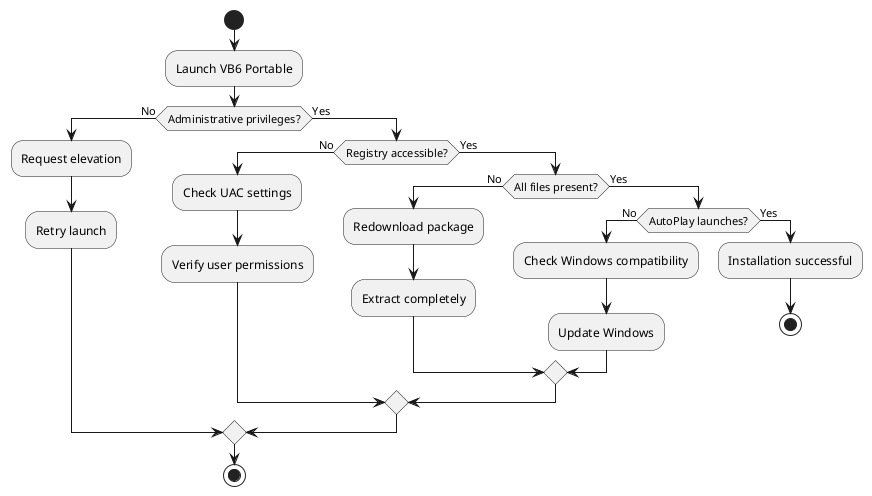
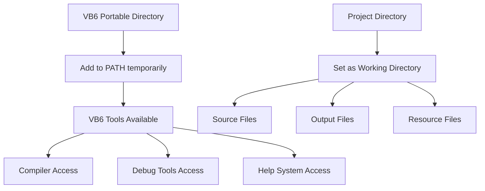

# Installation Guide

## System Requirements

### Minimum Requirements
- **Operating System**: Windows XP SP3 or later
- **Memory**: 512MB RAM
- **Disk Space**: 150MB free space
- **Permissions**: Administrative privileges (for initial setup)

### Recommended Requirements
- **Operating System**: Windows 7 or later
- **Memory**: 1GB RAM or more
- **Disk Space**: 500MB free space
- **Permissions**: Standard user (after initial setup)

## Installation Process



## Step-by-Step Installation

### Step 1: Download and Extract

1. Download the VB6 Portable IDE package
2. Extract the contents to your desired location (e.g., `C:\PortableApps\VB6` or USB drive)
3. Ensure the directory structure remains intact

```
VB6-Portable-IDE/
├── Visual Basic 6 Portable.exe
├── Visual Basic 6 Portable/
│   ├── autorun.exe
│   ├── ico.ico
│   └── AutoPlay/
└── README.md
```

### Step 2: Initial Launch



### Step 3: Configuration

The AutoPlay interface will guide you through:

1. **License Validation**: Automatic setup of VB6 licensing
2. **Component Registration**: Registration of VB6 DLLs and controls
3. **Environment Configuration**: Path and registry settings



## Installation Verification

### Verify Installation

1. Launch `Visual Basic 6 Portable.exe`
2. AutoPlay interface should appear
3. Click "Start VB6" or equivalent option
4. VB6 IDE should launch successfully

### Common Installation Checks



## Network Installation

For organizations deploying across multiple machines:



## USB/Portable Drive Installation



## Uninstallation

To remove VB6 Portable IDE:

### Complete Removal



### Registry Cleanup (Optional)

If you want to completely remove VB6 licensing:

1. Open Registry Editor (`regedit.exe`) as Administrator
2. Navigate to `HKEY_CLASSES_ROOT\Licenses\`
3. Remove VB6-related license entries
4. Navigate to `HKEY_LOCAL_MACHINE\SOFTWARE\Microsoft\VisualStudio\6.0\`
5. Remove VB6 configuration entries

**⚠️ Warning**: Only perform registry cleanup if you're certain you won't need VB6 licensing for other applications.

## Troubleshooting Installation

### Common Issues

| Issue | Symptom | Solution |
|-------|---------|----------|
| **Permission Denied** | Cannot launch executable | Run as Administrator |
| **Missing DLL** | Component load errors | Verify file integrity |
| **Registry Access** | License validation fails | Check UAC settings |
| **AutoPlay Won't Start** | Black screen on launch | Check Windows compatibility |

### Advanced Troubleshooting



## Post-Installation Configuration

### Environment Variables

The portable IDE may set temporary environment variables:
- `VB6_ROOT`: Points to portable installation directory
- `VB6_TEMP`: Temporary files location
- `VB6_PROJECT`: Default project directory

### Path Configuration



This completes the installation process. The VB6 Portable IDE should now be ready for development work.