# Technical Reference

## System Components

### Core Components Overview

```plantuml
@startuml
package "VB6 Portable IDE" {
    component "Main Launcher" as ML {
        port "Entry Point" as EP
        port "Registry Interface" as RI
    }
    
    component "AutoPlay Engine" as AE {
        port "UI Interface" as UI
        port "Media System" as MS
    }
    
    component "VB6 Runtime" as VR {
        port "IDE Interface" as II
        port "Compiler Interface" as CI
        port "Debug Interface" as DI
    }
    
    component "Registry Manager" as RM {
        port "License Manager" as LM
        port "Component Registry" as CR
    }
}

ML::EP --> AE::UI
ML::RI --> RM::LM
AE::MS --> VR::II
VR::CI --> VR::DI
RM::CR --> VR::II
@enduml
```

## File Structure

### Directory Layout

```
VB6-Portable-IDE/
├── Visual Basic 6 Portable.exe          # Main launcher executable
├── Visual Basic 6 Portable/             # Core system directory
│   ├── autorun.exe                       # AutoPlay executable
│   ├── ico.ico                          # Application icon
│   └── AutoPlay/                        # AutoPlay system files
│       ├── Audio/                       # Sound effects
│       │   ├── Click1.ogg              # UI click sound
│       │   └── High1.ogg               # Alert sound
│       ├── Icons/                       # UI icons
│       │   └── ico.ico                  # Interface icons
│       ├── Images/                      # UI graphics
│       │   ├── 12.bmp                   # Background images
│       │   ├── images_1.jpg            # Interface graphics
│       │   ├── algeria.png              # Theme graphics
│       │   ├── ico_alpha_Error_32x32.png # Error icons
│       │   └── images.jpg               # Additional graphics
│       ├── Plugins/                     # Plugin system
│       │   └── SHAPE/                   # Shape plugin
│       │       └── SHAPE.APO           # Plugin object
│       ├── Docs/                        # System documentation
│       │   ├── VbPortable6.reg         # Registry entries
│       │   └── Portable.VB6/           # VB6 runtime files
│       │       ├── Vb6.exe             # VB6 IDE executable
│       │       ├── C2.exe              # C2 compiler
│       │       ├── Link.exe            # Linker utility
│       │       ├── Vb6stkit.dll        # Setup toolkit
│       │       ├── Vb6ext.olb          # VB6 extensions
│       │       ├── Dao350.dll          # Database access
│       │       ├── Mspdb60.dll         # Debug database
│       │       ├── Vbaexe6.lib         # VBA executable lib
│       │       ├── Vb6debug.dll        # Debug runtime
│       │       ├── Vb6.olb             # VB6 object library
│       │       ├── Mrt7enu.dll         # Runtime English
│       │       └── Vba6.dll            # VBA runtime
│       └── autorun.cdd                 # AutoPlay configuration
├── docs/                               # Documentation (this structure)
│   ├── architecture.md                 # System architecture
│   ├── installation.md                # Installation guide
│   ├── user-guide.md                  # User documentation
│   ├── technical-reference.md         # This file
│   └── troubleshooting.md             # Problem resolution
└── README.md                           # Project overview
```

### File Types and Purposes

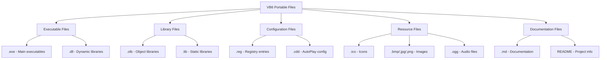

## VB6 Runtime Components

### Core VB6 Files

| File | Purpose | Description |
|------|---------|-------------|
| `Vb6.exe` | Main IDE | Visual Basic 6.0 Integrated Development Environment |
| `C2.exe` | Compiler | Native code compiler backend |
| `Link.exe` | Linker | Links compiled objects into executables |
| `Vba6.dll` | VBA Runtime | Visual Basic for Applications runtime |
| `Vb6debug.dll` | Debug Support | Debugging and breakpoint support |
| `Vb6stkit.dll` | Setup Toolkit | Application distribution tools |

### Component Dependencies

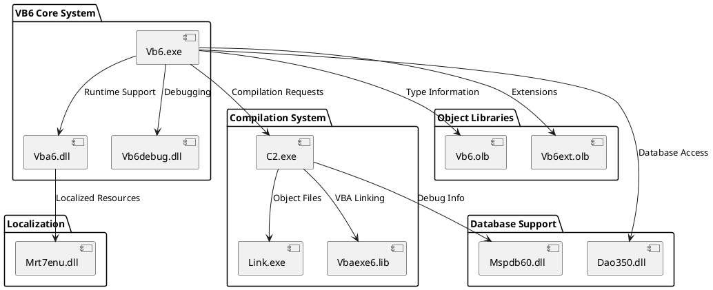

## Registry Configuration

### License Keys Structure

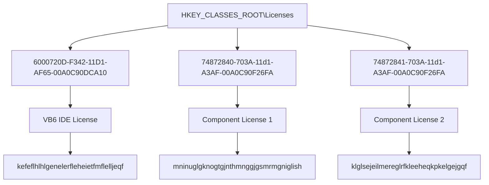

### Registry Deployment Sequence

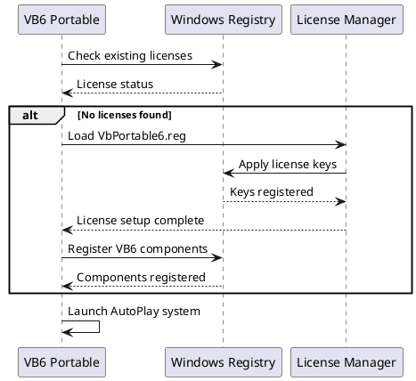

## Memory Architecture

### Memory Layout

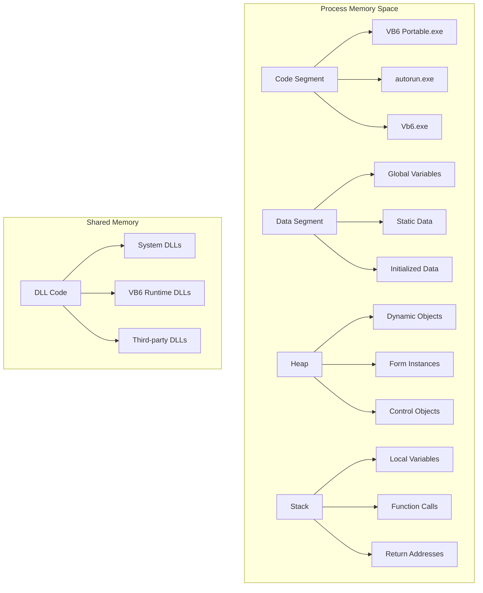

### Memory Management Strategy

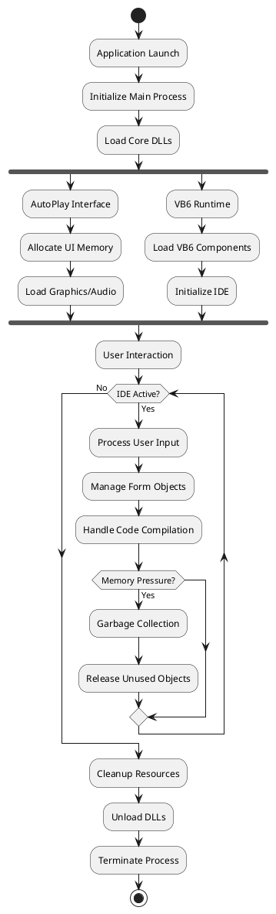

## Security Model

### Permission Requirements

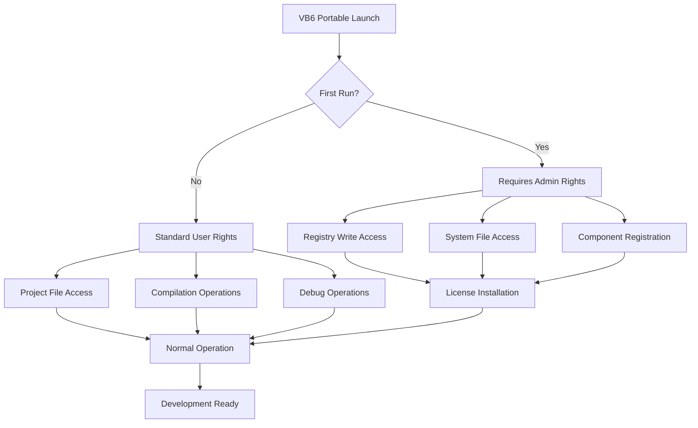

### Security Boundaries

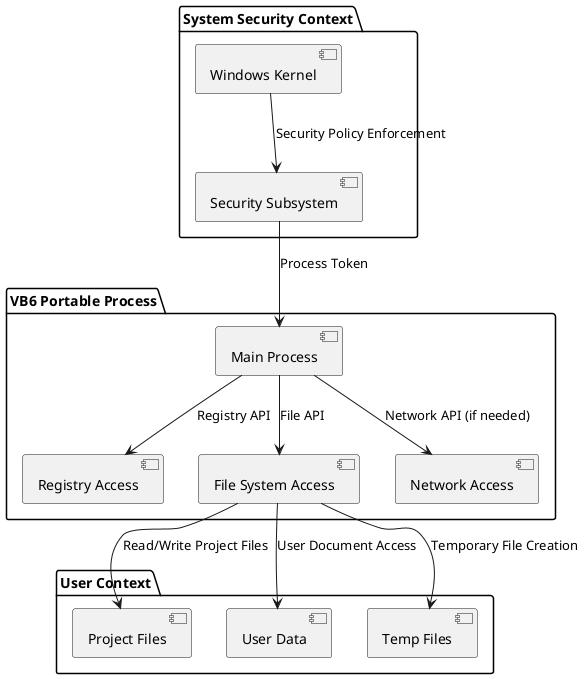

## Performance Characteristics

### Startup Performance

```mermaid
gantt
    title VB6 Portable Startup Performance
    dateFormat X
    axisFormat %s
    
    section Process Launch
    Executable Load       :done, load, 0, 500ms
    DLL Resolution       :done, dll, after load, 300ms
    Registry Check       :done, reg, after dll, 200ms
    
    section AutoPlay Init
    Interface Loading    :done, ui, after reg, 400ms
    Resource Loading     :done, res, after ui, 300ms
    Audio System        :done, audio, after res, 100ms
    
    section VB6 Launch
    IDE Initialization   :active, ide, after audio, 800ms
    Component Loading    :comp, after ide, 600ms
    Ready State         :milestone, after comp, 0s
```

### Memory Usage Patterns

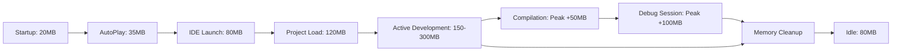

## API Reference

### Main Launcher API

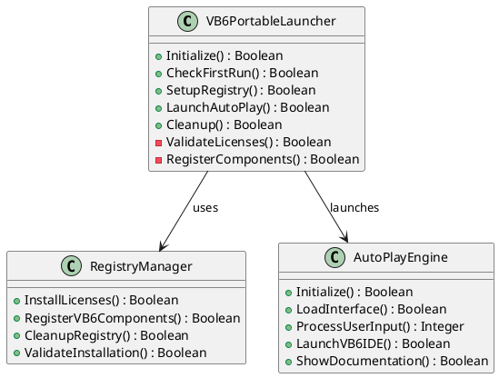

### Error Codes

| Code | Category | Description |
|------|----------|-------------|
| 0 | Success | Operation completed successfully |
| 1001 | Registry | Failed to access registry |
| 1002 | Registry | License installation failed |
| 1003 | Registry | Component registration failed |
| 2001 | File System | Missing core files |
| 2002 | File System | Permission denied |
| 2003 | File System | Disk space insufficient |
| 3001 | VB6 Runtime | VB6.exe not found |
| 3002 | VB6 Runtime | DLL load failure |
| 3003 | VB6 Runtime | Incompatible version |
| 4001 | AutoPlay | Interface load failure |
| 4002 | AutoPlay | Resource missing |
| 4003 | AutoPlay | Audio system failure |

## Configuration Options

### AutoPlay Configuration

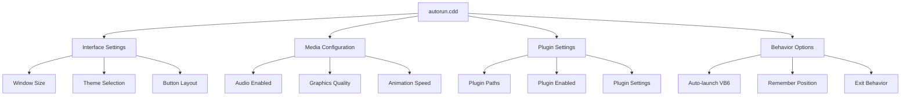

### VB6 IDE Configuration

VB6 IDE settings are managed through the standard VB6 configuration system:

- **Editor Settings**: Stored in registry under VB6 IDE keys
- **Window Layouts**: Saved with user profile
- **Compiler Options**: Per-project settings in .vbp files
- **Debug Settings**: Global and project-specific options

## Deployment Scenarios

### Single User Deployment

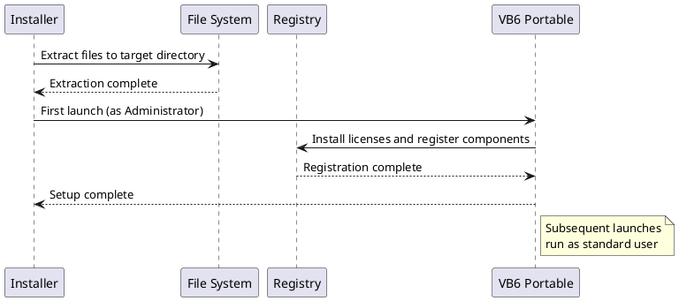

### Multi-user Deployment

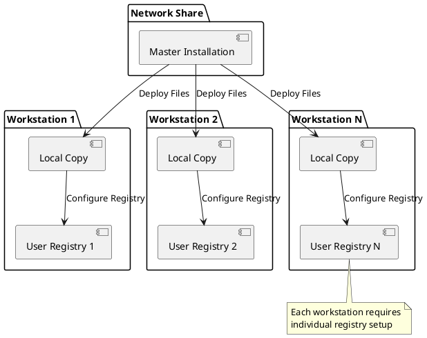

## Extensibility

### Plugin Architecture

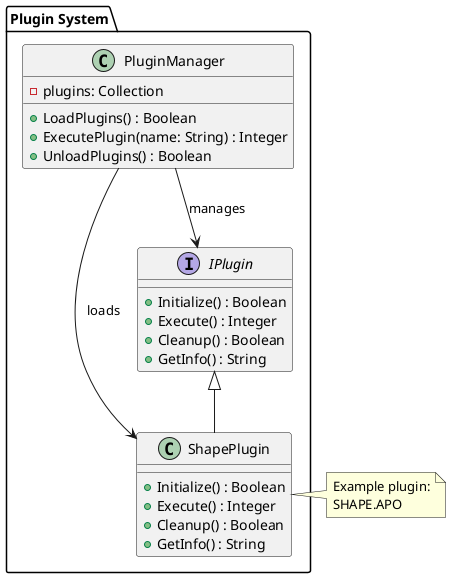

## Troubleshooting Reference

### Diagnostic Commands

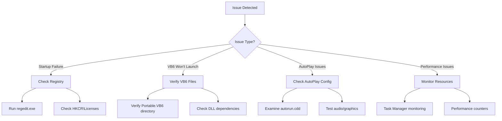

This technical reference provides comprehensive details for system administrators, developers, and advanced users working with the VB6 Portable IDE system.