# Troubleshooting Guide

## Common Issues and Solutions

This guide helps resolve common problems when using the VB6 Portable IDE.

## Startup Issues

### Application Won't Launch

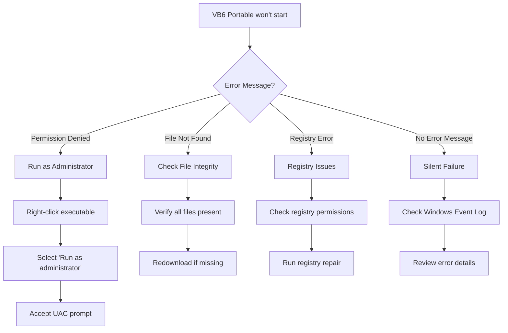

#### Solution Steps

1. **Permission Issues**
   ```plantuml
   @startuml
   start
   :Launch VB6 Portable;
   if (Admin Rights?) then (No)
       :Right-click executable;
       :Select "Run as administrator";
       :Confirm UAC prompt;
   else (Yes)
       :Proceed with launch;
   endif
   if (Registry Access?) then (No)
       :Check Windows UAC settings;
       :Verify user account type;
   else (Yes)
       :Continue startup sequence;
   endif
   stop
   @enduml
   ```

2. **File Integrity Check**
   - Verify all files from the [file structure](technical-reference.md#file-structure)
   - Check file sizes and dates
   - Re-extract from original archive if files are missing

3. **Registry Diagnostics**
   ```bash
   # Run as Administrator in Command Prompt
   reg query "HKEY_CLASSES_ROOT\Licenses\6000720D-F342-11D1-AF65-00A0C90DCA10"
   ```

### AutoPlay Interface Issues

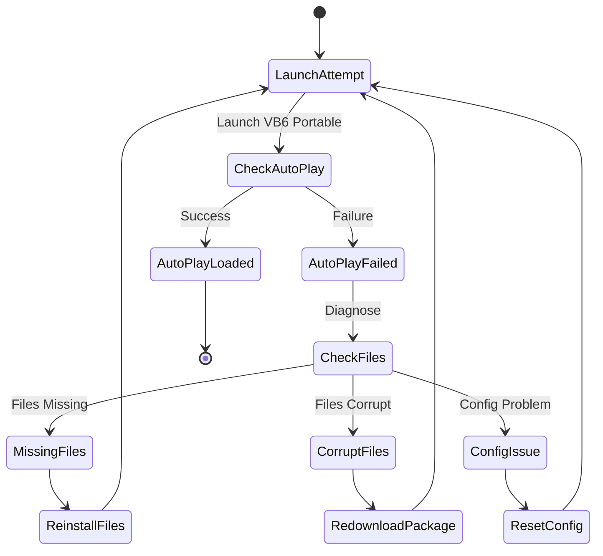

#### AutoPlay Troubleshooting Steps

| Issue | Symptoms | Solution |
|-------|----------|----------|
| **Black Screen** | AutoPlay window appears but shows nothing | Check graphics compatibility, update display drivers |
| **No Audio** | Interface loads but no sound effects | Verify audio files in AutoPlay/Audio/ directory |
| **Buttons Not Working** | Interface displays but clicks don't work | Check autorun.cdd configuration file |
| **Slow Loading** | AutoPlay takes excessive time to load | Check available memory and close other applications |

## VB6 IDE Issues

### IDE Won't Start from AutoPlay

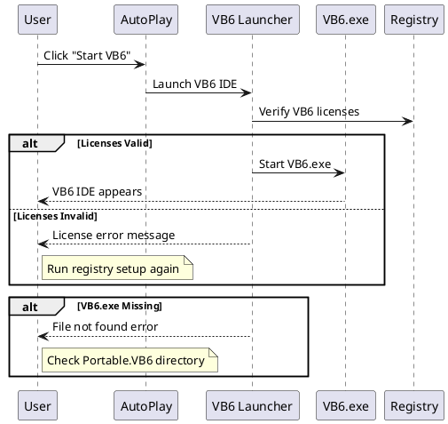

#### Common VB6 Launch Problems

1. **Missing VB6.exe**
   - Location: `Visual Basic 6 Portable/AutoPlay/Docs/Portable.VB6/Vb6.exe`
   - Solution: Verify file exists and has proper permissions

2. **DLL Load Errors**
   ```mermaid
   graph TD
   A[DLL Load Error] --> B{Which DLL?}
   B -->|Vba6.dll| C[VBA Runtime Missing]
   B -->|Dao350.dll| D[Database Support Missing]
   B -->|Mspdb60.dll| E[Debug Support Missing]
   
   C --> F[Check Portable.VB6 directory]
   D --> F
   E --> F
   
   F --> G[Restore missing DLL]
   G --> H[Re-register components]
   ```

3. **License Validation Failures**
   - Check registry entries under `HKEY_CLASSES_ROOT\Licenses\`
   - Run `VbPortable6.reg` file as Administrator
   - Verify license strings match expected values

### Development Environment Issues

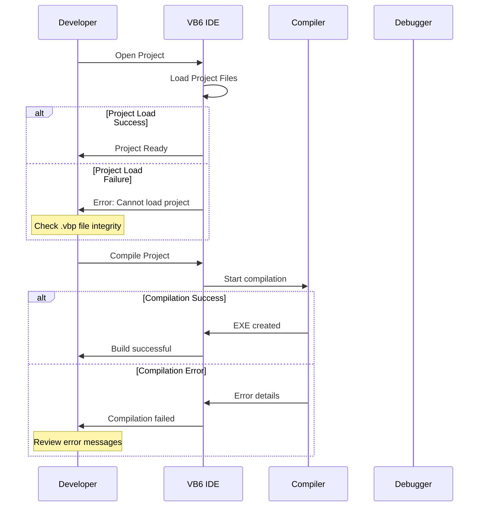

## Performance Issues

### Slow Performance Diagnosis

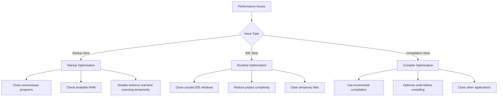

### Memory Usage Optimization

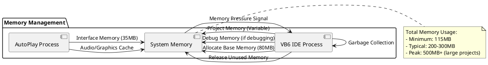

## Configuration Issues

### Registry Problems

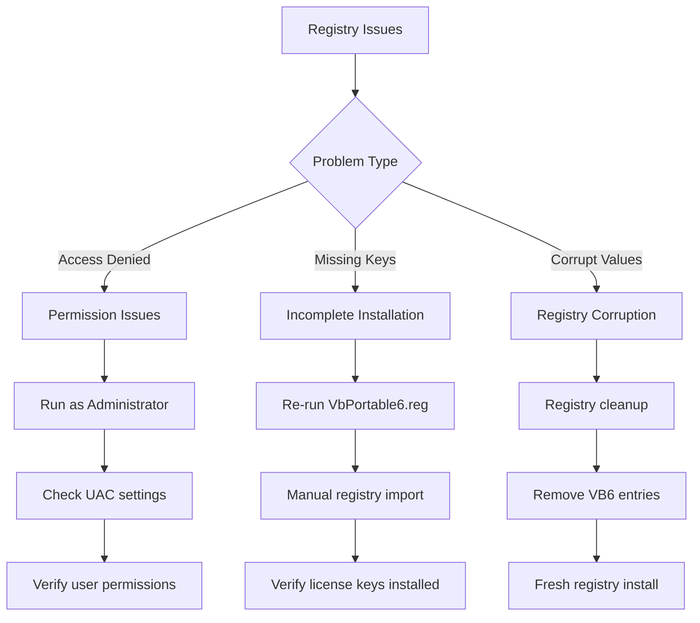

### File Association Problems

Some users may experience issues with VB6 file associations. Here's how to diagnose and fix:

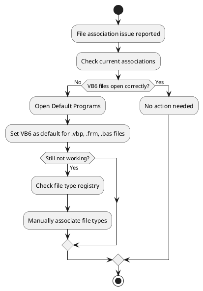

## Error Messages

### Common Error Codes and Solutions

| Error Code | Message | Cause | Solution |
|------------|---------|-------|----------|
| **429** | ActiveX component can't create object | Missing or unregistered component | Re-register VB6 components, check COM registration |
| **76** | Path not found | Invalid file path in project | Update project file paths, verify file locations |
| **53** | File not found | Missing project file or resource | Restore missing files, update file references |
| **91** | Object variable or With block variable not set | Uninitialized object reference | Initialize objects before use, check Nothing assignments |
| **13** | Type mismatch | Incompatible data types | Verify variable types, check function parameters |

### Debugging Error Messages

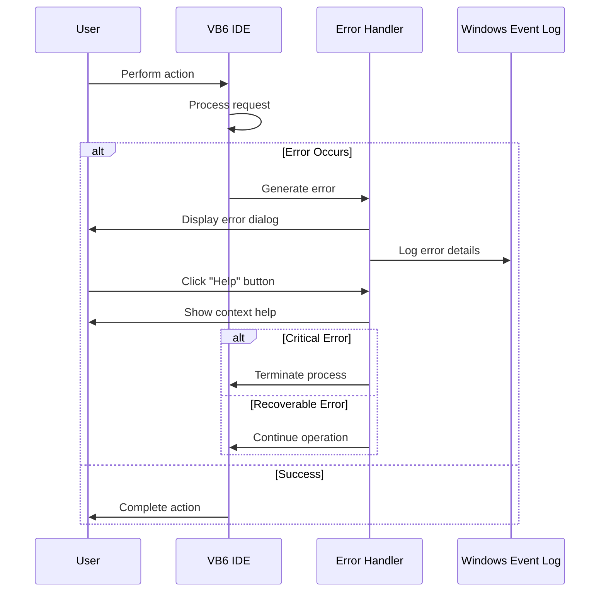

## Network and Deployment Issues

### Multi-User Environment Problems

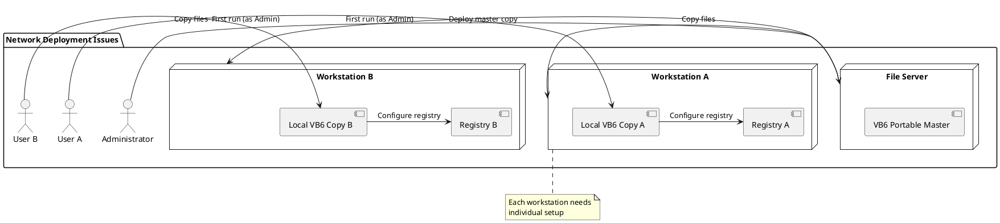

### USB/Portable Drive Issues

Common problems when running from removable media:

1. **Drive Letter Changes**
   - VB6 may store absolute paths
   - Solution: Use relative paths in projects

2. **Write Permissions**
   - Some USB drives are read-only
   - Solution: Check drive properties, format if necessary

3. **Performance Issues**
   - USB 2.0 vs USB 3.0 speed differences
   - Solution: Use faster USB drives or copy to local disk

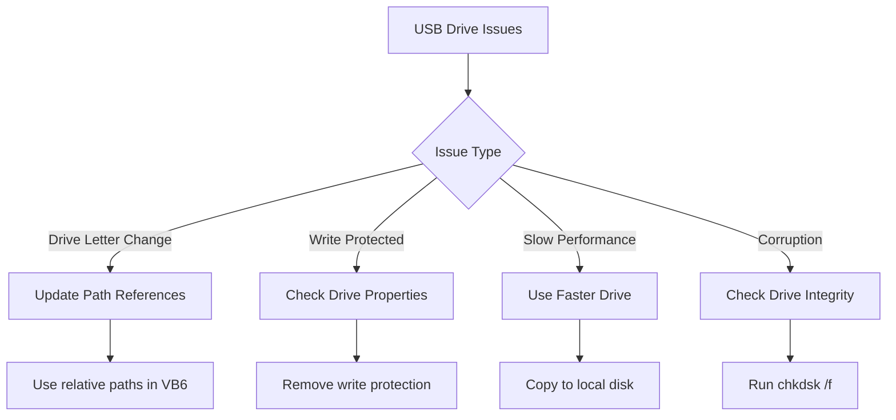

## Advanced Troubleshooting

### System Diagnostic Tools

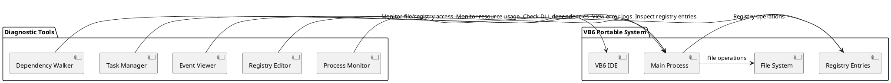

### Log Analysis

When troubleshooting complex issues:

1. **Windows Event Log**
   - Application logs for VB6 errors
   - System logs for permission issues

2. **Process Monitor**
   - Track file and registry access
   - Identify permission problems

3. **VB6 Debug Output**
   - Use Debug.Print statements
   - Check Immediate Window for errors

### Recovery Procedures

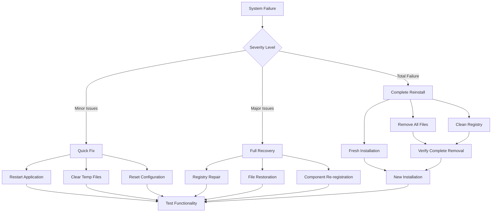

## Getting Additional Help

### Support Resources

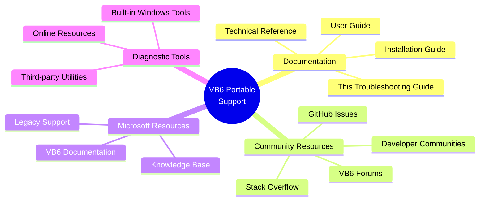

### Creating Bug Reports

When reporting issues:

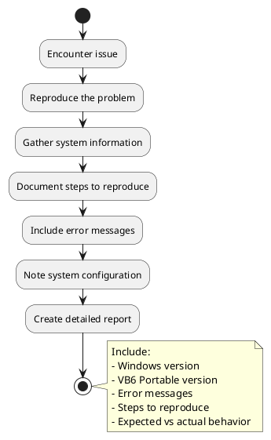

### Information to Include

- **System Information**: Windows version, architecture, available memory
- **VB6 Portable Version**: Build date, file sizes, installation location
- **Error Details**: Exact error messages, error codes, timestamps  
- **Reproduction Steps**: Detailed steps to recreate the issue
- **Environment**: Antivirus software, other development tools installed
- **Files**: Relevant log files, screenshots of error messages

This troubleshooting guide covers the most common issues encountered with VB6 Portable IDE. For issues not covered here, refer to the [Technical Reference](technical-reference.md) or create a detailed bug report using the guidelines above.