# User Guide

## Getting Started

This guide will help you effectively use the VB6 Portable IDE for Visual Basic 6.0 development.

## Launching the IDE

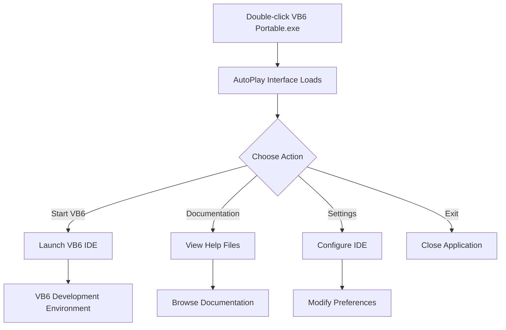

## AutoPlay Interface

The AutoPlay interface serves as the main launcher for the VB6 Portable IDE.

### Main Menu Options

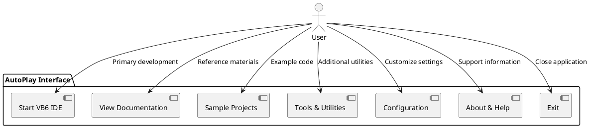

## VB6 IDE Workflow

### Project Development Cycle

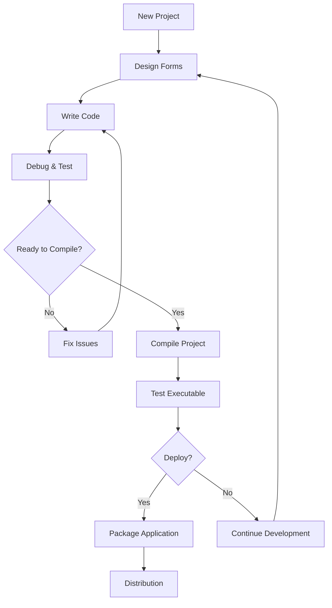

### Form Designer Usage

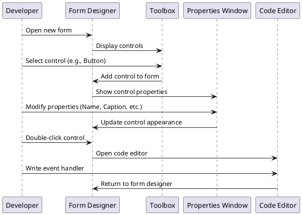

## Common Development Tasks

### Creating a New Project

1. **Start VB6 IDE** through AutoPlay interface
2. **Select Project Type**:
   - Standard EXE (most common)
   - ActiveX EXE
   - ActiveX DLL
   - ActiveX Control
3. **Configure Project Properties**
4. **Begin Development**

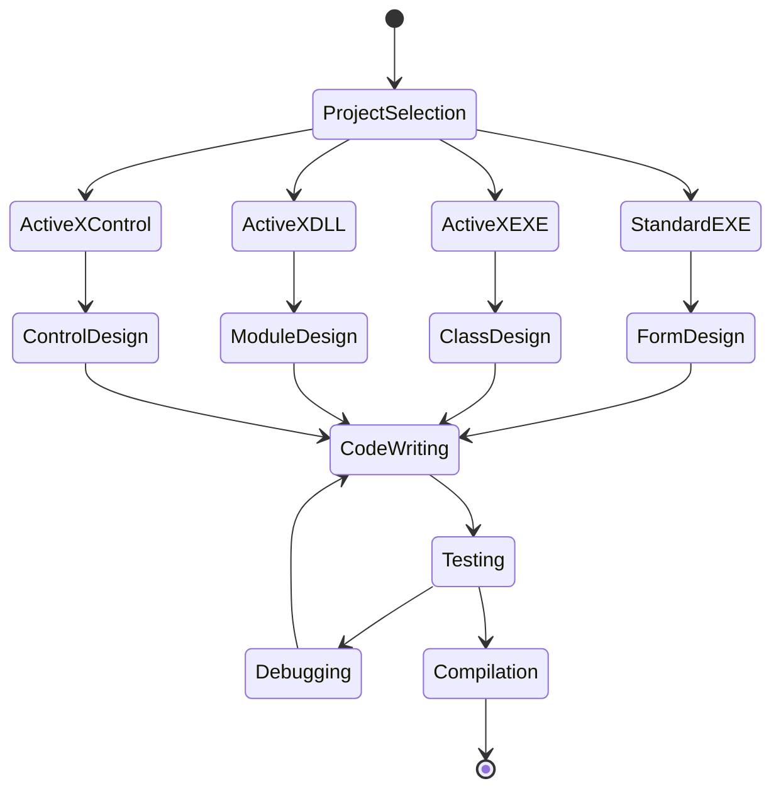

### Adding Controls and Components

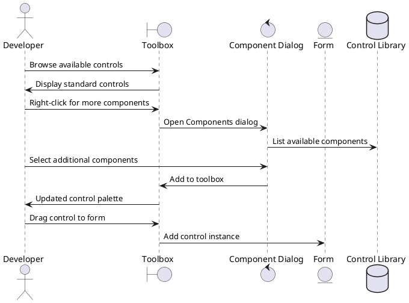

### Debugging Workflow

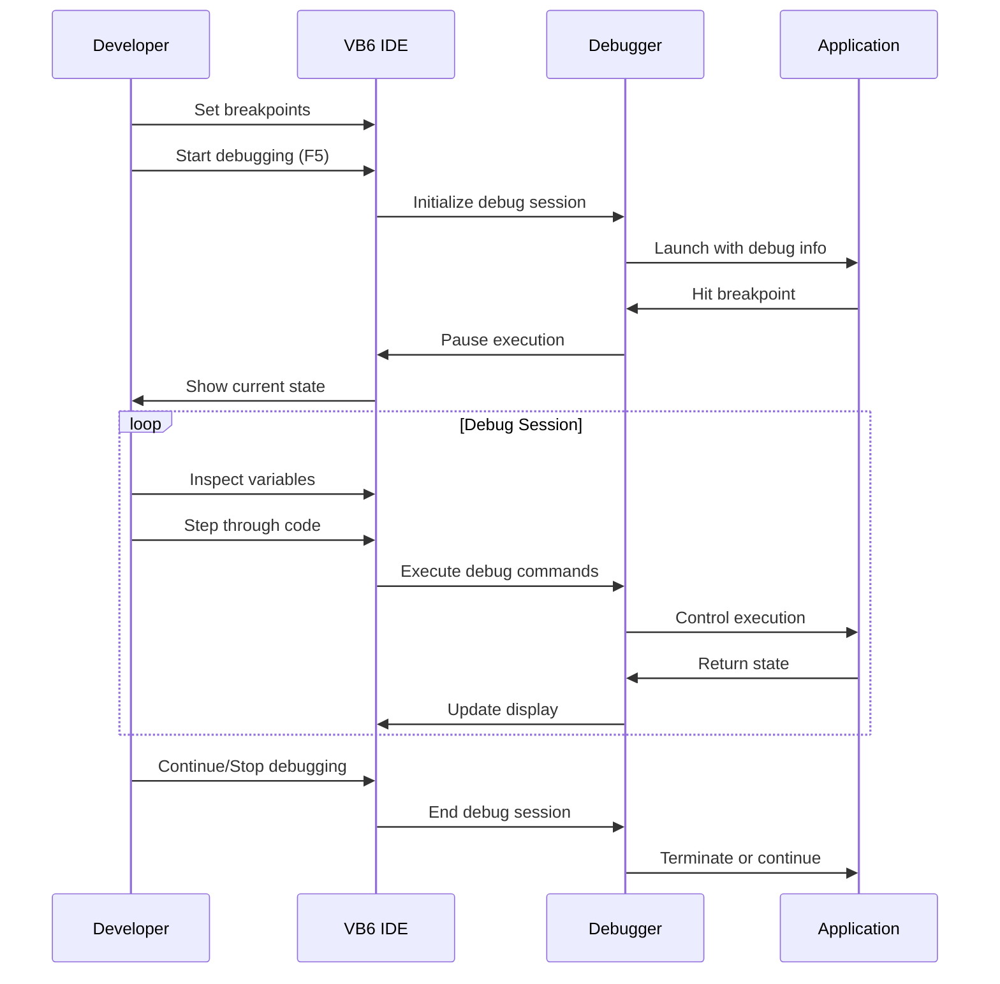

## Advanced Features

### Project Management

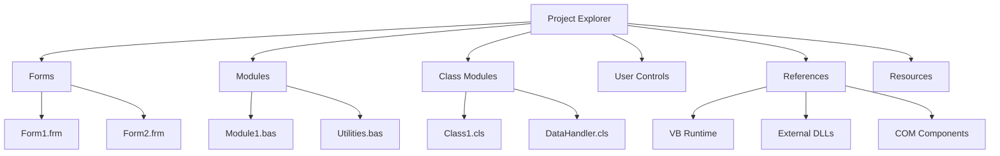

### Code Editor Features

The VB6 IDE includes several productivity features:

#### IntelliSense Support

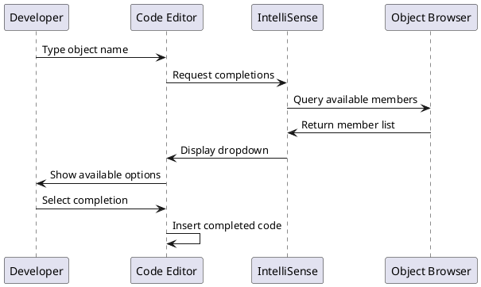

#### Syntax Highlighting

- **Keywords**: Blue text (Dim, If, For, etc.)
- **Comments**: Green text (lines starting with ')
- **Strings**: Red text (quoted text)
- **Errors**: Red underline for syntax errors

### Compilation Options

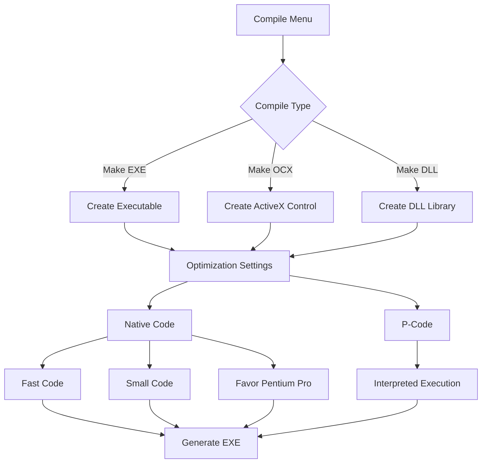

## Working with Files and Projects

### File Types in VB6

| Extension | Description | Purpose |
|-----------|-------------|---------|
| `.vbp` | Project File | Main project definition |
| `.frm` | Form File | User interface forms |
| `.bas` | Module File | Code modules |
| `.cls` | Class Module | Object-oriented classes |
| `.ctl` | User Control | Custom controls |
| `.exe` | Executable | Compiled application |
| `.ocx` | ActiveX Control | Compiled ActiveX component |
| `.dll` | Dynamic Library | Compiled DLL component |

### Project Structure Best Practices

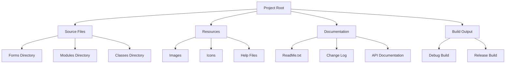

## Tips and Tricks

### Keyboard Shortcuts

| Shortcut | Action |
|----------|---------|
| `F5` | Run/Start Debugging |
| `Ctrl+Break` | Stop Execution |
| `F8` | Step Into |
| `Shift+F8` | Step Over |
| `Ctrl+Shift+F8` | Step Out |
| `F9` | Toggle Breakpoint |
| `Ctrl+G` | Go to Line |
| `Ctrl+F` | Find |
| `Ctrl+H` | Replace |
| `F2` | Object Browser |

### Performance Optimization

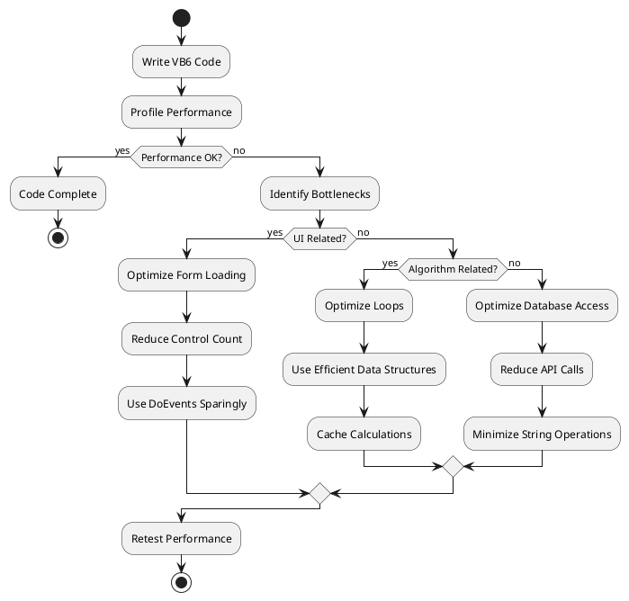

### Error Handling

```vb
Private Sub Example_ErrorHandling()
    On Error GoTo ErrorHandler
    
    ' Your code here
    Dim result As Integer
    result = 10 / 0  ' This will cause an error
    
    Exit Sub
    
ErrorHandler:
    Select Case Err.Number
        Case 11  ' Division by zero
            MsgBox "Cannot divide by zero!"
        Case Else
            MsgBox "Error " & Err.Number & ": " & Err.Description
    End Select
    Resume Next
End Sub
```

### Memory Management

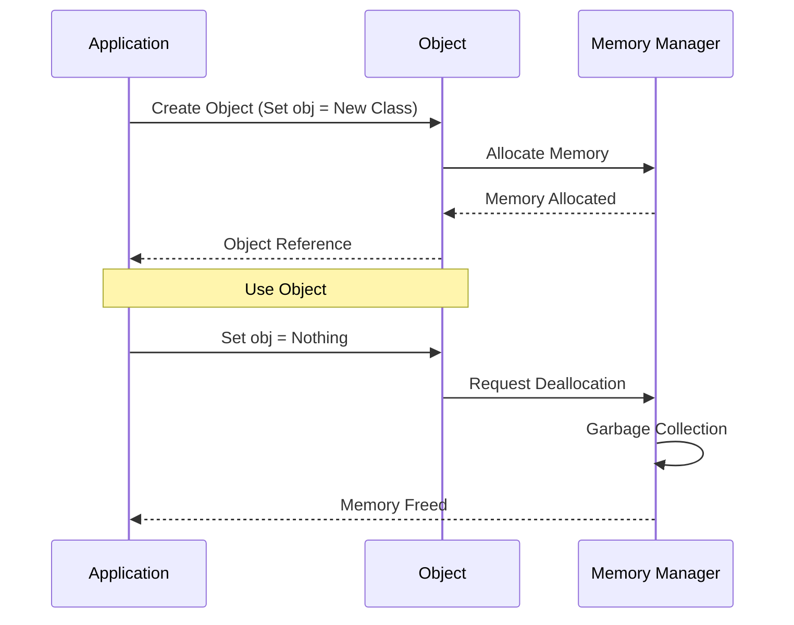

## Troubleshooting Common Issues

### Compilation Errors

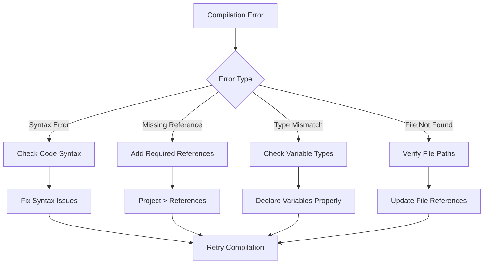

### Runtime Errors

Common runtime issues and solutions:

1. **Error 91 - Object variable not set**
   - Ensure objects are properly initialized
   - Check for Nothing references

2. **Error 13 - Type mismatch**
   - Verify data types in assignments
   - Check function parameter types

3. **Error 9 - Subscript out of range**
   - Validate array bounds
   - Check collection indices

### Getting Help

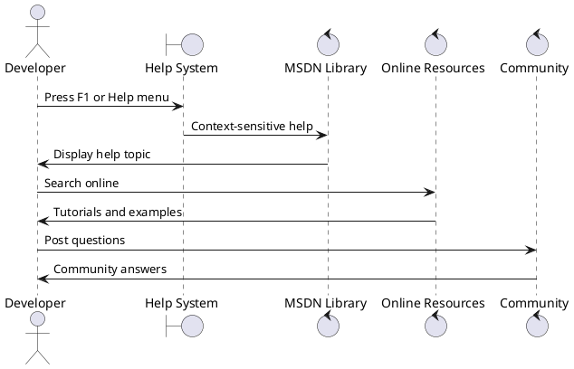

This user guide provides comprehensive coverage of using the VB6 Portable IDE effectively. For specific technical details, refer to the [Technical Reference](technical-reference.md) documentation.